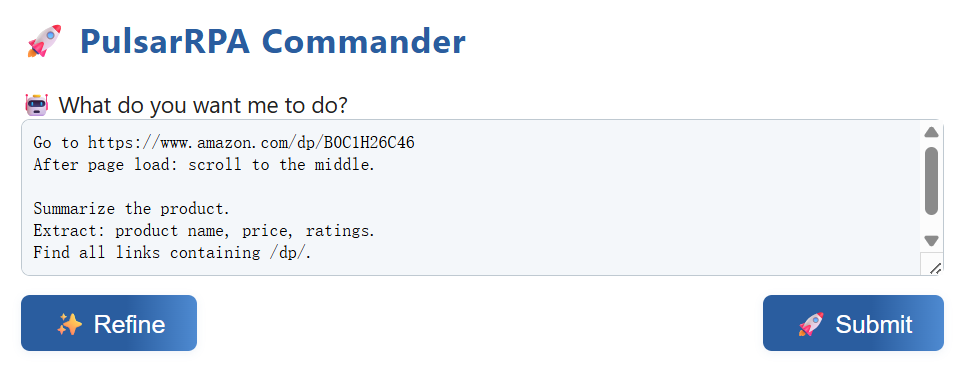

# 🤖 PulsarRPA

[](https://hub.docker.com/r/galaxyeye88/pulsar-rpa)
[](https://github.com/platonai/PulsarRPA/blob/main/LICENSE)
[](https://spring.io/projects/spring-boot)

---

[English](README.md) | 简体中�| [中国镜�](https://gitee.com/platonai_galaxyeye/PulsarRPA)

## 🌟 介�

💖 **PulsarRPA: 由AI驱动的超快�览器自动化解决方�** 💖

### �核心能力:

- 🤖 **AI集��大语言模�** �由大语言模�驱动的更智能自动化�
- �**超快自动�* ��程安全的�览器自动化并�，爬虫级别的抓�性能�
- 🧠 **网页�解** �深度�解动�网页内容�
- 📊 **数���API** �强大的结�化数�轻���工具�

---

通过简�文本��大规模�览器自动化和数����

```text
访问 https://www.amazon.com/dp/B08PP5MSVB

�览器�动�: 清除�览器cookies�
页�加载� 滚动到页�中间�

总结产�信��
��: 产��称�价格�评分�
查找所有包�/dp/ 的链��
```

---

## � 演示视频

� YouTube:
[](https://www.youtube.com/watch?v=_BcryqWzVMI)

📺 哔哩哔哩:
[https://www.bilibili.com/video/BV1kM2rYrEFC](https://www.bilibili.com/video/BV1kM2rYrEFC)


---

# 🚀 快速开始指�

## ▶� �行 PulsarRPA

### 📦 �行�执行JAR �最佳体�

#### 🧩 下载

```shell
curl -L -o PulsarRPA.jar https://github.com/platonai/PulsarRPA/releases/download/v3.0.17/PulsarRPA.jar
```

#### 🚀 �行

```shell
# 确�设置了LLM API密钥。支�VOLCENGINE_API_KEY/OPENAI_API_KEY�
echo $DEEPSEEK_API_KEY
java -D"DEEPSEEK_API_KEY=${DEEPSEEK_API_KEY}" -jar PulsarRPA.jar
```

> � **�示:** 确�已在�境中设置`DEEPSEEK_API_KEY`或其他LLM API密钥，�则AI功能将��用�

> � **�示:** Windows PowerShell语法: `$env:DEEPSEEK_API_KEY`(�境��) vs `$DEEPSEEK_API_KEY`(脚本��)�

---

<details>
<summary>📂 资�</summary>

* 🟦 [GitHub Release 下载](https://github.com/platonai/PulsarRPA/releases/download/v3.0.17/PulsarRPA.jar)
* � [镜�/备份下载](https://static.platonai.cn/repo/ai/platon/pulsar/)
* 🛠�[LLM�置指�](docs/config/llm/llm-config.md)
* 🛠�[�置指�](docs/config.md)

</details>

### �使用IDE�行

<details>

- 在IDE中打开项目
- �行`ai.platon.pulsar.app.PulsarApplicationKt`主类

</details>

### � Docker用户

<details>

```shell
# 确�设置了LLM API密钥。支�VOLCENGINE_API_KEY/OPENAI_API_KEY�
echo $DEEPSEEK_API_KEY
docker run -d -p 8182:8182 -e DEEPSEEK_API_KEY=${DEEPSEEK_API_KEY} galaxyeye88/pulsar-rpa:latest
```
</details>

---

## 🌟 ���学���需文本，无需代��

使用`commands` API执行�览器�作���网页数��分�网站等�

### 📥 示例请求(基�文本):

网页界�: http://localhost:8182/command.html



<details>
<summary>REST API</summary>

#### 📄 纯文本版�
```shell
curl -X POST "http://localhost:8182/api/commands/plain" -H "Content-Type: text/plain" -d '
    访问 https://www.amazon.com/dp/B08PP5MSVB

    �览器�动�: 清除�览器cookies�
    页�加载� 滚动到页�中间�

    总结产�信��
    ��: 产��称�价格�评分�
    查找所有包�/dp/ 的链��
  '
```

#### 📄 JSON版本:

```shell
curl -X POST "http://localhost:8182/api/commands" -H "Content-Type: application/json" -d '{
    "url": "https://www.amazon.com/dp/B08PP5MSVB",
    "onBrowserLaunchedActions": ["清除�览器cookies"],
    "onPageReadyActions": ["滚动到页�中�],
    "pageSummaryPrompt": "简�介�这个产��,
    "dataExtractionRules": "产��称�价格和评分",
    "uriExtractionRules": "页�上所有包�`/dp/`的链�
  }'
```

💡 **�示:** 您�需�填写�个字���填写您需�的�

</details>

## � ��高级用户 �LLM + X-SQL: 精准��活�强�

利用`x/e` API进行高度精确��活和智能的数����

  ```shell
  curl -X POST "http://localhost:8182/api/x/e" -H "Content-Type: text/plain" -d "
  select
    llm_extract(dom, '产��称�价格�评�) as llm_extracted_data,
    dom_base_uri(dom) as url,
    dom_first_text(dom, '#productTitle') as title,
    dom_first_slim_html(dom, 'img:expr(width > 400)') as img
  from load_and_select('https://www.amazon.com/dp/B08PP5MSVB', 'body');
  "
  ```

��数�示例:

```json
{
  "llm_extracted_data": {
    "产��称": "Apple iPhone 15 Pro Max",
    "ä»·æ ¼": "$1,199.00",
    "评分": "4.5 out of 5 stars"
  },
  "url": "https://www.amazon.com/dp/B08PP5MSVB",
  "title": "Apple iPhone 15 Pro Max",
  "img": ""
}
```

* X-SQL指�: [X-SQL](docs/x-sql.md)

---

## 👨����专家 - �生API: 功能强大!

### 🚀 超快页�访问和数���

PulsarRPA通过基��程的并���高速并行网页抓�，在最�化资�开销的�时�供高效的数����

<details>

```kotlin
val args = "-refresh -dropContent -interactLevel fastest"
val resource = "seeds/amazon/best-sellers/leaf-categories.txt"
val links =
    LinkExtractors.fromResource(resource).asSequence().map { ListenableHyperlink(it, "", args = args) }.onEach {
        it.eventHandlers.browseEventHandlers.onWillNavigate.addLast { page: Page, driver: WebDriver ->
            driver.addBlockedURLs(blockingUrls)
        }
    }.toList()

session.submitAll(links)
```

� 示例: [查看Kotlin代�](https://github.com/platonai/PulsarRPA/blob/master/pulsar-app/pulsar-examples/src/main/kotlin/ai/platon/pulsar/examples/advanced/HighPerformanceCrawler.kt)

</details>

### � �览器��

PulsarRPA��了�程安全的�览器�制�

<details>

```kotlin
val prompts = """
将光标移到id�title'的元素上并点�
滚动到页�中�
滚动到页�顶�
��id�title'的元素的文本
"""

val eventHandlers = DefaultPageEventHandlers()
eventHandlers.browseEventHandlers.onDocumentActuallyReady.addLast { page: Page, driver: WebDriver ->
    val result = session.instruct(prompts, driver)
}
session.open(url, eventHandlers)
```
� 示例: [查看Kotlin代�](/pulsar-app/pulsar-examples/src/main/kotlin/ai/platon/pulsar/examples/llm/TalkToActivePage.kt)

</details>

---

### 🤖 机器人�程自动化能力:

PulsarRPA�供�活的机器人�程自动化能力�

<details>

```kotlin
val options = session.options(args)
val event = options.eventHandlers.browseEventHandlers
event.onBrowserLaunched.addLast { page: Page, driver: WebDriver ->
    warnUpBrowser(page, driver)
}
event.onWillFetch.addLast { page: Page, driver: WebDriver ->
    waitForReferrer(page, driver)
    waitForPreviousPage(page, driver)
}
event.onWillCheckDocumentState.addLast { page: Page, driver: WebDriver ->
    driver.waitForSelector("body h1[itemprop=name]")
    driver.click(".mask-layer-close-button")
}
session.load(url, options)
```
� 示例: [查看Kotlin代�](/pulsar-app/pulsar-examples/src/main/kotlin/ai/platon/pulsar/examples/sites/food/dianping/RestaurantCrawler.kt)

</details>

---

### � 使用X-SQL进行��数���:

PulsarRPA�供X-SQL用���数����

<details>

```sql
select
    llm_extract(dom, '产��称�价格�评分�评分�) as llm_extracted_data,
    dom_first_text(dom, '#productTitle') as title,
    dom_first_text(dom, '#bylineInfo') as brand,
    dom_first_text(dom, '#price tr td:matches(^Price) ~ td') as price,
    dom_first_text(dom, '#acrCustomerReviewText') as ratings,
    str_first_float(dom_first_text(dom, '#reviewsMedley .AverageCustomerReviews span:contains(out of)'), 0.0) as score
from load_and_select('https://www.amazon.com/dp/B08PP5MSVB  -i 1s -njr 3', 'body');
```

📚 示例代�:
* [亚马逊产�页�抓�100+字段)](https://github.com/platonai/exotic-amazon/tree/main/src/main/resources/sites/amazon/crawl/parse/sql/crawl)
* [所有亚马逊页�类�抓�](https://github.com/platonai/exotic-amazon/tree/main/src/main/resources/sites/amazon/crawl/parse/sql/crawl)

</details>

---

## 📜 文档

* 📖 [REST API示例](docs/rest-api-examples.md)
* 🛠�[LLM�置指�](docs/config/llm/llm-config.md)
* 🛠�[�置指�](docs/config.md)
* 📚 [����建](docs/development/build.md)
* 🧠 [专家指�](docs/advanced-guides.md)

---

## 🔧 代� - 解除网站��

<details>

设置�境��PROXY_ROTATION_URL为代��务�供的URL:

```shell
export PROXY_ROTATION_URL=https://your-proxy-provider.com/rotation-endpoint
```

�次访问轮�URL时，它应返�包�一个或多个新代�IP的�应�
请�您的代��供商询问这样的URL�

</details>

---

## �特�

🕷�**网络爬虫**
- �扩展爬�
- �览器渲�
- AJAX数���

🤖 **AI驱动**
- 自动字段��
- 模�识别
- 准确数���

🧠 **LLM集�**
- 自然语言网页内容分�
- 直观内容�述

� **文本到动�*
- 简�语言命令
- 直观�览器��

🤖 **RPA能力**
- 类人任务自动�
- SPA爬�支�
- 高级工作�自动化

🛠�**开�者��*
- 一行数���
- SQL�查询��
- 简�API集�

📊 **X-SQL强大功能**
- 扩展SQL用�网页数�
- 内容挖�能力
- Web商业智能

🛡�**机器人防�*
- 高级�身技�
- IP轮�
- ��上下文管�

�**性能**
- 并行页�渲染
- 高效处�
- 抗��设�

💰 **�本效益**
- �天100,000+页�
- 最�硬件��
- 资�高效�行

�**质���**
- 智能�试机制
- 精确调度
- 完整生命周期管�

� **�扩展�*
- 完全分布���
- 大规模能�
- �业级就�

📦 **存储选项**
- 本地文件系统
- MongoDB
- HBase
- Gora支�

📊 **监�**
- 全�日志
- 详细指标
- 完全���

## � �系我们

- 💬 微信: galaxyeye
- � 微�: [galaxyeye](https://weibo.com/galaxyeye)
- 📧 邮箱: galaxyeye@live.cn, ivincent.zhang@gmail.com
- � �特: galaxyeye8
- � 网站: [platon.ai](https://platon.ai)

<div style="display: flex;">
  
</div>
