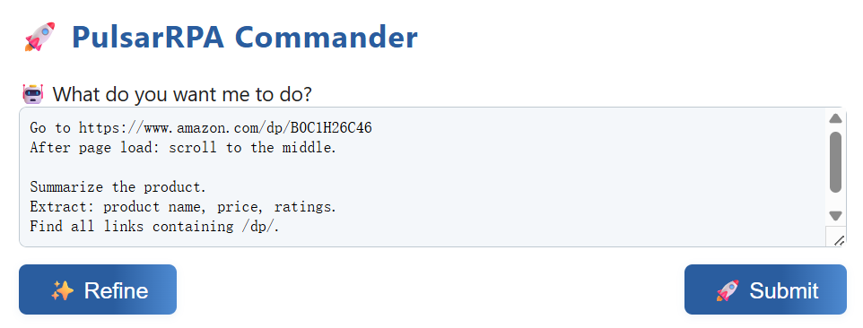

# 🤖 PulsarRPA

[](https://hub.docker.com/r/galaxyeye88/pulsar-rpa)
[](https://github.com/platonai/PulsarRPA/blob/main/LICENSE)
[](https://spring.io/projects/spring-boot)

---

[English](README.md) | 简体中文 | [中国镜像](https://gitee.com/platonai_galaxyeye/PulsarRPA)

## 🌟 项目介绍

💖 **PulsarRPA：AI驱动的闪电级浏览器自动化解决方案！** 💖

### ✨ 核心能力：

- 🤖 **AI集成与大语言模型** – 由大语言模型驱动的智能自动化
- ⚡ **超高速自动化** – 协程安全的浏览器并发自动化，爬虫级性能表现
- 🧠 **网页理解能力** – 深度理解动态网页内容
- 📊 **数据提取API** – 强大的结构化数据提取工具

---

通过简单的文本描述，实现大规模浏览器自动化和数据提取。

```text
访问 https://www.amazon.com/dp/B0C1H26C46

浏览器启动后：清除浏览器cookies
页面加载后：滚动到页面中间

总结产品信息
提取：产品名称、价格、评分
查找所有包含 /dp/ 的链接
```

---

## 🎥 演示视频

🔥 Bilibili：
[https://www.bilibili.com/video/BV1kM2rYrEFC](https://www.bilibili.com/video/BV1kM2rYrEFC)

🎬 YouTube：
[](https://www.youtube.com/watch?v=_BcryqWzVMI)

---

# 🚀 快速开始指南

## ▶️ 运行 PulsarRPA

### 📦 运行可执行JAR包 — 最佳体验

#### 🧩 下载


```bash
# Linux/macOS/Windows（使用 curl）
curl -L -o PulsarRPA.jar https://github.com/platonai/PulsarRPA/releases/download/v3.0.12/PulsarRPA.jar
```

#### 🚀 运行

Linux/MacOS：
```bash
echo $DEEPSEEK_API_KEY # 确保设置了大语言模型API密钥
java -DEEPSEEK_API_KEY=${DEEPSEEK_API_KEY} -jar PulsarRPA.jar
```

Windows：
```powershell
echo $env:DEEPSEEK_API_KEY # 确保设置了大语言模型API密钥
java -DEEPSEEK_API_KEY=$env:DEEPSEEK_API_KEY -jar PulsarRPA.jar
```

> 🔍 **提示：** 确保在环境中设置了 `DEEPSEEK_API_KEY` 或者其他提供商的 API KEY，否则AI功能将不可用。

---

<details>
<summary>📂 资源下载</summary>

* 🟦 [GitHub发布下载](https://github.com/platonai/PulsarRPA/releases/download/v3.0.12/PulsarRPA.jar)
* 📁 [镜像/备份下载](https://static.platonai.cn/repo/ai/platon/pulsar/)
* 🛠️ [大语言模型配置指南](docs/config/llm/llm-config.md)
* 🛠️ [配置指南](docs/config.md)

</details>

### ▶ 使用IDE运行

<details>

- 在IDE中打开项目
- 运行 `ai.platon.pulsar.app.PulsarApplicationKt` 主类

</details>

### 🐳 Docker用户

<details>

Linux/MacOS：
```shell
echo $DEEPSEEK_API_KEY # 确保设置了大语言模型API密钥
docker run -d -p 8182:8182 -e DEEPSEEK_API_KEY=${DEEPSEEK_API_KEY} galaxyeye88/pulsar-rpa:latest
```

Windows：
```powershell
echo $env:DEEPSEEK_API_KEY # 确保设置了大语言模型API密钥
docker run -d -p 8182:8182 -e DEEPSEEK_API_KEY=$env:DEEPSEEK_API_KEY galaxyeye88/pulsar-rpa:latest
```

</details>

---

## 🌟 新手入门 – 纯文本描述，无需编程！

使用 `commands` API 执行浏览器操作、提取网页数据、分析网站等功能。

### 📥 示例请求（基于文本描述）：

网页界面：http://localhost:8182/command.html



<details>
<summary>REST API</summary>

#### 📄 纯文本版本：
```shell
curl -X POST "http://localhost:8182/api/commands/plain" -H "Content-Type: text/plain" -d '
    访问 https://www.amazon.com/dp/B0C1H26C46
    
    浏览器启动后：清除浏览器cookies
    页面加载后：滚动到页面中间
    
    总结产品信息
    提取：产品名称、价格、评分
    查找所有包含 /dp/ 的链接
  '
```

#### 📄 JSON版本：

```bash
curl -X POST "http://localhost:8182/api/commands" -H "Content-Type: application/json" -d '{
    "url": "https://www.amazon.com/dp/B0C1H26C46",
    "onBrowserLaunchedActions": ["清除浏览器cookies"],
    "onPageReadyActions": ["滚动到页面中间"],
    "pageSummaryPrompt": "提供这个产品的简要介绍",
    "dataExtractionRules": "产品名称、价格和评分",
    "uriExtractionRules": "页面上所有包含 `/dp/` 的链接"
  }'
```

💡 **提示：** 您不需要填写每个字段 — 只需填写您需要的内容。

</details>

## 🎓 进阶用户 — 大语言模型 + X-SQL：精确、灵活、强大

利用 `x/e` API 的强大功能，实现高精度、灵活且智能的数据提取。

  ```bash
  curl -X POST "http://localhost:8182/api/x/e" -H "Content-Type: text/plain" -d "
  select
    llm_extract(dom, '产品名称、价格、评分') as llm_extracted_data,
    dom_base_uri(dom) as url,
    dom_first_text(dom, '#productTitle') as title,
    dom_first_slim_html(dom, 'img:expr(width > 400)') as img
  from load_and_select('https://www.amazon.com/dp/B0C1H26C46', 'body');
  "
  ```

提取数据示例：

```json
{
  "llm_extracted_data": {
    "产品名称": "Apple iPhone 15 Pro Max",
    "价格": "$1,199.00",
    "评分": "4.5星（满分5星）"
  },
  "url": "https://www.amazon.com/dp/B0C1H26C46",
  "title": "Apple iPhone 15 Pro Max",
  "img": ""
}
```

* X-SQL指南：[X-SQL](docs/x-sql.md)

---

## 👨‍💻 专家用户 - 原生API：功能强大！

### 🚀 超快速页面访问和数据提取：

PulsarRPA 以协程速度并行访问网页，高效提取数据的同时最小化资源消耗。

<details>

```kotlin
val args = "-refresh -dropContent -interactLevel fastest"
val resource = "seeds/amazon/best-sellers/leaf-categories.txt"
val links =
    LinkExtractors.fromResource(resource).asSequence().map { ListenableHyperlink(it, "", args = args) }.onEach {
        it.eventHandlers.browseEventHandlers.onWillNavigate.addLast { page, driver ->
            driver.addBlockedURLs(blockingUrls)
        }
    }.toList()

session.submitAll(links)
```

📝 Example: [View Kotlin Code](https://github.com/platonai/PulsarRPA/blob/master/pulsar-app/pulsar-examples/src/main/kotlin/ai/platon/pulsar/examples/advanced/HighPerformanceCrawler.kt)

</details>

### 🎮 浏览器控制：

PulsarRPA 实现了协程安全的浏览器控制。

<details>

```kotlin
val prompts = """
将鼠标移动到id为'title'的元素并点击
滚动到页面中间
滚动到页面顶部
获取id为'title'的元素文本
"""

val eventHandlers = DefaultPageEventHandlers()
eventHandlers.browseEventHandlers.onDocumentActuallyReady.addLast { page, driver ->
    val result = session.instruct(prompts, driver)
}
session.open(url, eventHandlers)
```
📝 示例：[查看Kotlin代码](/pulsar-app/pulsar-examples/src/main/kotlin/ai/platon/pulsar/examples/llm/TalkToActivePage.kt)

</details>

---

### 🤖 机器人流程自动化能力：

PulsarRPA 提供灵活的机器人流程自动化。

<details>

```kotlin
val options = session.options(args)
val event = options.eventHandlers.browseEventHandlers
event.onBrowserLaunched.addLast { page, driver ->
    warnUpBrowser(page, driver)
}
event.onWillFetch.addLast { page, driver ->
    waitForReferrer(page, driver)
    waitForPreviousPage(page, driver)
}
event.onWillCheckDocumentState.addLast { page, driver ->
    driver.waitForSelector("body h1[itemprop=name]")
    driver.click(".mask-layer-close-button")
}
session.load(url, options)
```
📝 示例：[查看Kotlin代码](/pulsar-app/pulsar-examples/src/main/kotlin/ai/platon/pulsar/examples/sites/food/dianping/RestaurantCrawler.kt)

</details>

---

### 🔍 使用X-SQL进行复杂数据提取：

PulsarRPA 提供 X-SQL 进行复杂数据提取。

<details>

```sql
select
    llm_extract(dom, '产品名称、价格、评分、评分数值') as llm_extracted_data,
    dom_first_text(dom, '#productTitle') as title,
    dom_first_text(dom, '#bylineInfo') as brand,
    dom_first_text(dom, '#price tr td:matches(^Price) ~ td') as price,
    dom_first_text(dom, '#acrCustomerReviewText') as ratings,
    str_first_float(dom_first_text(dom, '#reviewsMedley .AverageCustomerReviews span:contains(out of)'), 0.0) as score
from load_and_select('https://www.amazon.com/dp/B0C1H26C46  -i 1s -njr 3', 'body');
```

📚 示例代码：
* [亚马逊产品页面抓取（100+字段）](https://github.com/platonai/exotic-amazon/tree/main/src/main/resources/sites/amazon/crawl/parse/sql/crawl)
* [全部亚马逊页面类型抓取](https://github.com/platonai/exotic-amazon/tree/main/src/main/resources/sites/amazon/crawl/parse/sql/crawl)

</details>

---

## 📜 文档

* 📖 [REST API示例](docs/rest-api-examples.md)
* 🛠️ [大语言模型配置指南](docs/config/llm/llm-config.md)
* 🛠️ [配置指南](docs/config.md)
* 📚 [从源码构建](docs/development/build.md)
* 🧠 [专家指南](docs/advanced-guides.md)

---

## 🔧 代理服务器 - 解锁网站访问

<details>

设置环境变量 PROXY_ROTATION_URL 为您的代理服务提供的URL：

```shell
export PROXY_ROTATION_URL=https://your-proxy-provider.com/rotation-endpoint
```

每次访问轮换URL时，它应该返回包含一个或多个新鲜代理IP的响应。
请向您的代理服务提供商询问此类URL。

</details>

---

## ✨ 功能特性

🕷️ **网络爬虫**
- 可扩展爬取
- 浏览器渲染
- AJAX数据提取

🤖 **AI驱动**
- 自动字段提取
- 模式识别
- 精确数据捕获

🧠 **大语言模型集成**
- 自然语言网页内容分析
- 直观的内容描述

🎯 **文本转操作**
- 简单语言命令
- 直观的浏览器控制

🤖 **机器人流程自动化能力**
- 类人任务自动化
- 单页应用程序爬取支持
- 高级工作流自动化

🛠️ **开发者友好**
- 一行代码数据提取
- 类SQL查询接口
- 简单API集成

📊 **X-SQL强大功能**
- 为网页数据扩展的SQL
- 内容挖掘能力
- 网络商业智能

🛡️ **反爬虫保护**
- 高级隐身技术
- IP轮换
- 隐私上下文管理

⚡ **高性能**
- 并行页面渲染
- 高效处理
- 抗阻塞设计

💰 **成本效益**
- 每天100,000+页面
- 最低硬件要求
- 资源高效运行

✅ **质量保证**
- 智能重试机制
- 精确调度
- 完整生命周期管理

🌐 **可扩展性**
- 完全分布式架构
- 大规模处理能力
- 企业级就绪

📦 **存储选项**
- 本地文件系统
- MongoDB
- HBase
- Gora支持

📊 **监控功能**
- 全面日志记录
- 详细指标
- 完全透明

## 📞 联系我们

- 💬 微信：galaxyeye
- 🌐 微博：[galaxyeye](https://weibo.com/galaxyeye)
- 📧 邮箱：galaxyeye@live.cn, ivincent.zhang@gmail.com
- 🐦 推特：galaxyeye8
- 🌍 官网：[platon.ai](https://platon.ai)

<div style="display: flex;">
  
</div>