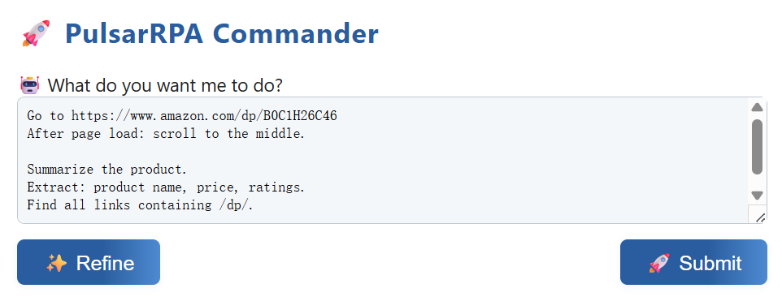

# 🤖 PulsarRPA

[](https://hub.docker.com/r/galaxyeye88/pulsar-rpa)
[](https://github.com/platonai/PulsarRPA/stargazers)
[](https://github.com/platonai/PulsarRPA/blob/main/LICENSE)
[](https://spring.io/projects/spring-boot)
[](https://github.com/platonai/PulsarRPA/releases)
[](https://github.com/platonai/PulsarRPA/actions)
[](https://kotlinlang.org/)
[](https://www.oracle.com/java/technologies/)
[](https://www.python.org/)

---

English | [简体中文](README-CN.md) | [中国镜像](https://gitee.com/platonai_galaxyeye/PulsarRPA)

## 🌟 Introduction

💖 **PulsarRPA: The AI-Powered, Lightning-Fast Browser Automation Solution!** 💖

### ✨ Key Capabilities:

- 🤖 **AI Integration with LLMs** – Smarter automation powered by large language models.
- ⚡ **Ultra-Fast Automation** – Coroutine-safe browser automation concurrency, spider-level crawling performance.
- 🧠 **Web Understanding** – Deep comprehension of dynamic web content.
- 📊 **Data Extraction APIs** – Powerful tools to extract structured data effortlessly.

---

Automate the browser and extract data at scale with simple text.

```text
Go to https://www.amazon.com/dp/B0C1H26C46

After browser launch: clear browser cookies.
After page load: scroll to the middle.

Summarize the product.
Extract: product name, price, ratings.
Find all links containing /dp/.
```

---

## 🎥 Demo Videos

🎬 YouTube:
[](https://www.youtube.com/watch?v=_BcryqWzVMI)

📺 Bilibili:
[https://www.bilibili.com/video/BV1kM2rYrEFC](https://www.bilibili.com/video/BV1kM2rYrEFC)


---

# 🚀 Quick Start Guide

## ▶️ Run PulsarRPA

### 📦 Run the Executable JAR — Best Experience

#### 🧩 Download

```shell
curl -L -o PulsarRPA.jar https://github.com/platonai/PulsarRPA/releases/download/v3.0.12/PulsarRPA.jar
```

#### 🚀 Run

```shell
# make sure LLM api key is set. VOLCENGINE_API_KEY/OPENAI_API_KEY also supported.
echo $DEEPSEEK_API_KEY
java -D"DEEPSEEK_API_KEY=${DEEPSEEK_API_KEY}" -jar PulsarRPA.jar
```

> 🔍 **Tip:** Make sure `DEEPSEEK_API_KEY` or other LLM API key is set in your environment, or AI features will not be available.

> 🔍 **Tip:** On Windows, `$DEEPSEEK_API_KEY` and `$env:DEEPSEEK_API_KEY` are different.

---

<details>
<summary>📂 Resources</summary>

* 🟦 [GitHub Release Download](https://github.com/platonai/PulsarRPA/releases/download/v3.0.12/PulsarRPA.jar)
* 📁 [Mirror / Backup Download](https://static.platonai.cn/repo/ai/platon/pulsar/)
* 🛠️ [LLM Configuration Guide](docs/config/llm/llm-config.md)
* 🛠️ [Configuration Guide](docs/config.md)

</details>

### ▶ Run with IDE

<details>

- Open the project in your IDE
- Run the `ai.platon.pulsar.app.PulsarApplicationKt` main class

</details>

### 🐳 Docker Users

<details>

```shell
# make sure LLM api key is set. VOLCENGINE_API_KEY/OPENAI_API_KEY also supported.
echo $DEEPSEEK_API_KEY
docker run -d -p 8182:8182 -e DEEPSEEK_API_KEY=${DEEPSEEK_API_KEY} galaxyeye88/pulsar-rpa:latest
```
</details>

---

## 🌟 For Beginners – Just Text, No Code!

Use the `commands` API to perform browser operations, extract web data, analyze websites, and more.

### 📥 Example Request (Text-based):

WebUI: http://localhost:8182/command.html



<details>
<summary>REST API</summary>

#### 📄 Plain-Text-Based Version:
```shell
curl -X POST "http://localhost:8182/api/commands/plain" -H "Content-Type: text/plain" -d '
    Go to https://www.amazon.com/dp/B0C1H26C46
    
    After browser launch: clear browser cookies.
    After page load: scroll to the middle.
    
    Summarize the product.
    Extract: product name, price, ratings.
    Find all links containing /dp/.
  '
```

#### 📄 JSON-Based Version:

```shell
curl -X POST "http://localhost:8182/api/commands" -H "Content-Type: application/json" -d '{
    "url": "https://www.amazon.com/dp/B0C1H26C46",
    "onBrowserLaunchedActions": ["clear browser cookies"],
    "onPageReadyActions": ["scroll to the middle"],
    "pageSummaryPrompt": "Provide a brief introduction of this product.",
    "dataExtractionRules": "product name, price, and ratings",
    "uriExtractionRules": "all links containing `/dp/` on the page"
  }'
```

💡 **Tip:** You don't need to fill in every field — just what you need.

</details>

## 🎓 For Advanced Users — LLM + X-SQL: Precise, Flexible, Powerful

Harness the power of the `x/e` API for highly precise, flexible, and intelligent data extraction.

  ```shell
  curl -X POST "http://localhost:8182/api/x/e" -H "Content-Type: text/plain" -d "
  select
    llm_extract(dom, 'product name, price, ratings') as llm_extracted_data,
    dom_base_uri(dom) as url,
    dom_first_text(dom, '#productTitle') as title,
    dom_first_slim_html(dom, 'img:expr(width > 400)') as img
  from load_and_select('https://www.amazon.com/dp/B0C1H26C46', 'body');
  "
  ```

The extracted data example:

```json
{
  "llm_extracted_data": {
    "product name": "Apple iPhone 15 Pro Max",
    "price": "$1,199.00",
    "ratings": "4.5 out of 5 stars"
  },
  "url": "https://www.amazon.com/dp/B0C1H26C46",
  "title": "Apple iPhone 15 Pro Max",
  "img": ""
}
```

* X-SQL Guide: [X-SQL](docs/x-sql.md)

---

## 👨‍💻 For Experts - Native API: Powerful!

### 🚀 Superfast Page Visiting and Data Extraction:

PulsarRPA visits web pages in parallel at coroutine speed, extracts data efficiency while minimizing resource consumption.

<details>

```kotlin
val args = "-refresh -dropContent -interactLevel fastest"
val resource = "seeds/amazon/best-sellers/leaf-categories.txt"
val links =
    LinkExtractors.fromResource(resource).asSequence().map { ListenableHyperlink(it, "", args = args) }.onEach {
        it.eventHandlers.browseEventHandlers.onWillNavigate.addLast { page, driver ->
            driver.addBlockedURLs(blockingUrls)
        }
    }.toList()

session.submitAll(links)
```

📝 Example: [View Kotlin Code](https://github.com/platonai/PulsarRPA/blob/master/pulsar-app/pulsar-examples/src/main/kotlin/ai/platon/pulsar/examples/advanced/HighPerformanceCrawler.kt)

</details>

### 🎮 Browser Control:

PulsarRPA implements coroutine-safe browser control.

<details>

```kotlin
val prompts = """
move cursor to the element with id 'title' and click it
scroll to middle
scroll to top
get the text of the element with id 'title'
"""

val eventHandlers = DefaultPageEventHandlers()
eventHandlers.browseEventHandlers.onDocumentActuallyReady.addLast { page, driver ->
    val result = session.instruct(prompts, driver)
}
session.open(url, eventHandlers)
```
📝 Example: [View Kotlin Code](/pulsar-app/pulsar-examples/src/main/kotlin/ai/platon/pulsar/examples/llm/TalkToActivePage.kt)

</details>

---

### 🤖 Robotic Process Automation Capabilities:

PulsarRPA provides flexible robotic process automation capabilities.

<details>

```kotlin
val options = session.options(args)
val event = options.eventHandlers.browseEventHandlers
event.onBrowserLaunched.addLast { page, driver ->
    warnUpBrowser(page, driver)
}
event.onWillFetch.addLast { page, driver ->
    waitForReferrer(page, driver)
    waitForPreviousPage(page, driver)
}
event.onWillCheckDocumentState.addLast { page, driver ->
    driver.waitForSelector("body h1[itemprop=name]")
    driver.click(".mask-layer-close-button")
}
session.load(url, options)
```
📝 Example: [View Kotlin Code](/pulsar-app/pulsar-examples/src/main/kotlin/ai/platon/pulsar/examples/sites/food/dianping/RestaurantCrawler.kt)

</details>

---

### 🔍 Complex Data Extraction with X-SQL:

PulsarRPA provides X-SQL for complex data extraction.

<details>

```sql
select
    llm_extract(dom, 'product name, price, ratings, score') as llm_extracted_data,
    dom_first_text(dom, '#productTitle') as title,
    dom_first_text(dom, '#bylineInfo') as brand,
    dom_first_text(dom, '#price tr td:matches(^Price) ~ td') as price,
    dom_first_text(dom, '#acrCustomerReviewText') as ratings,
    str_first_float(dom_first_text(dom, '#reviewsMedley .AverageCustomerReviews span:contains(out of)'), 0.0) as score
from load_and_select('https://www.amazon.com/dp/B0C1H26C46  -i 1s -njr 3', 'body');
```

📚 Example Code:
* [Amazon Product Page Scraping (100+ fields)](https://github.com/platonai/exotic-amazon/tree/main/src/main/resources/sites/amazon/crawl/parse/sql/crawl)
* [All Amazon Page Types Scraping](https://github.com/platonai/exotic-amazon/tree/main/src/main/resources/sites/amazon/crawl/parse/sql/crawl)

</details>

---

## 📜 Documents

* 📖 [REST API Examples](docs/rest-api-examples.md)
* 🛠️ [LLM Configuration Guide](docs/config/llm/llm-config.md)
* 🛠️ [Configuration Guide](docs/config.md)
* 📚 [Build from Source](docs/development/build.md)
* 🧠 [Expert Guide](docs/advanced-guides.md)

---

## 🔧 Proxies - Unblock Websites

<details>

Set the environment variable PROXY_ROTATION_URL to the URL provided by your proxy service:

```shell
export PROXY_ROTATION_URL=https://your-proxy-provider.com/rotation-endpoint
```

Each time the rotation URL is accessed, it should return a response containing one or more fresh proxy IPs.
Ask your proxy provider for such a URL.

</details>

---

## ✨ Features

🕷️ **Web Spider**
- Scalable crawling
- Browser rendering
- AJAX data extraction

🤖 **AI-Powered**
- Automatic field extraction
- Pattern recognition
- Accurate data capture

🧠 **LLM Integration**
- Natural language web content analysis
- Intuitive content description

🎯 **Text-to-Action**
- Simple language commands
- Intuitive browser control

🤖 **RPA Capabilities**
- Human-like task automation
- SPA crawling support
- Advanced workflow automation

🛠️ **Developer-Friendly**
- One-line data extraction
- SQL-like query interface
- Simple API integration

📊 **X-SQL Power**
- Extended SQL for web data
- Content mining capabilities
- Web business intelligence

🛡️ **Bot Protection**
- Advanced stealth techniques
- IP rotation
- Privacy context management

⚡ **Performance**
- Parallel page rendering
- High-efficiency processing
- Block-resistant design

💰 **Cost-Effective**
- 100,000+ pages/day
- Minimal hardware requirements
- Resource-efficient operation

✅ **Quality Assurance**
- Smart retry mechanisms
- Precise scheduling
- Complete lifecycle management

🌐 **Scalability**
- Fully distributed architecture
- Massive-scale capability
- Enterprise-ready

📦 **Storage Options**
- Local File System
- MongoDB
- HBase
- Gora support

📊 **Monitoring**
- Comprehensive logging
- Detailed metrics
- Full transparency

## 📞 Contact Us

- 💬 WeChat: galaxyeye
- 🌐 Weibo: [galaxyeye](https://weibo.com/galaxyeye)
- 📧 Email: galaxyeye@live.cn, ivincent.zhang@gmail.com
- 🐦 Twitter: galaxyeye8
- 🌍 Website: [platon.ai](https://platon.ai)

<div style="display: flex;">
  
</div>
