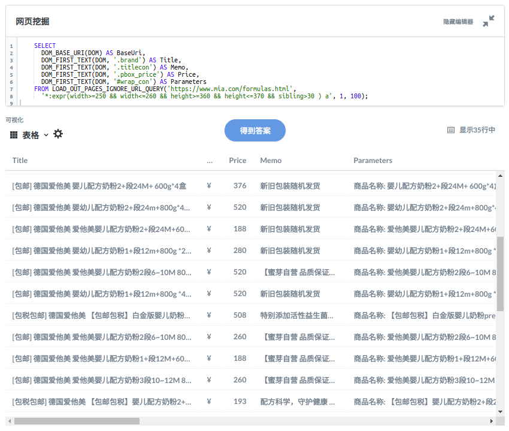

Pulsar README
===================
** Network As A Database **

Turn the Web into tables and charts using simple SQLs.

## Other language
[Chinese](README.zh.md)

# Features
- X-SQL: extend SQL to manage web data: Web crawling, scraping, Web content mining, BI on Web
- Web spider: browser rendering, ajax, scheduling, page scoring, monitoring, distributed, high performance, indexing by solr/elastic
- Big data: large scale, various storage: HBase/MongoDB

For more information check out [platon.ai](http://platon.ai)

## X-SQL

Scrape a single page:

    select
        dom_first_text(dom, '#productTitle') as `title`,
        dom_first_text(dom, '#price tr td:contains(List Price) ~ td') as `listprice`,
        dom_first_text(dom, '#price tr td:matches(^Price) ~ td, #price_inside_buybox') as `price`,
        array_join_to_string(dom_all_texts(dom, '#wayfinding-breadcrumbs_container ul li a'), '|') as `categories`,
        dom_base_uri(dom) as `baseUri`
    from
        load_and_select('https://www.amazon.com/dp/B00BTX5926', ':root')

Scrape pages from a portal:

    select
        dom_first_text(dom, '#productTitle') as `title`,
        dom_first_text(dom, '#price tr td:contains(List Price) ~ td') as `listprice`,
        dom_first_text(dom, '#price tr td:matches(^Price) ~ td, #price_inside_buybox') as `price`,
        array_join_to_string(dom_all_texts(dom, '#wayfinding-breadcrumbs_container ul li a'), '|') as `categories`,
        dom_base_uri(dom) as `baseUri`
    from
        load_out_pages('https://www.amazon.com/Best-Sellers/zgbs', 'a[href~=/dp/]')

# Build & Run

## Build from source

    git clone https://github.com/platonai/pulsar.git
    cd pulsar && bin/build.sh

## Start pulsar server if not started

    bin/pulsar

or if you are using an IDE, run main() in [PulsarMaster](pulsar-app\pulsar-master\src\main\kotlin\ai\platon\pulsar\app\master\PulsarMaster.kt)

## Issue a request to scrape

CURL

    curl -X POST --location "http://localhost:8182/x/e" -H "Content-Type: text/plain"     
    -d "select
            dom_first_text(dom, '#productTitle') as title,
            dom_first_text(dom, '#price tr td:contains(List Price) ~ td') as listprice,
            dom_first_text(dom, '#price tr td:matches(^Price) ~ td, #price_inside_buybox') as price,
            array_join_to_string(dom_all_texts(dom, '#wayfinding-breadcrumbs_container ul li a'), '|') as categories,
            dom_base_uri(dom) as baseUri
            from
        load_and_select('https://www.amazon.com/dp/B00BTX5926', ':root')"

PHP

    $sql = `...`;
    $ch = curl_init();
    curl_setopt($ch, CURLOPT_URL, "http://localhost:8182/x/e");
    curl_setopt($ch, CURLOPT_HTTPHEADER, array("Content-type: text/plain"));
    $output = curl_exec($ch);

kotlin:

    val sql = """..."""
    val request = HttpRequest.newBuilder().uri(URI.create("http://localhost:8182/x/e"))
        .header("Content-Type", "text/plain")
        .POST(BodyPublishers.ofString(sql)).build()
    val response = HttpClient.newHttpClient().send(request, BodyHandlers.ofString()).body()

java:

    String sql = "...";
    HttpRequest request = HttpRequest.newBuilder().uri(URI.create("http://localhost:8182/x/e"))
        .header("Content-Type", "text/plain")
        .POST(HttpRequest.BodyPublishers.ofString(sql)).build();
    String response = HttpClient.newHttpClient().send(request, HttpResponse.BodyHandlers.ofString()).body();

The responses are as the following:

    {
        "uuid": "cc611841-1f2b-4b6b-bcdd-ce822d97a2ad",
        "statusCode": 200,
        "pageStatusCode": 200,
        "pageContentBytes": 1607636,
        "resultSet": [
            {
                "title": "Tara Toys Ariel Necklace Activity Set - Amazon Exclusive (51394)",
                "listprice": "$19.99",
                "price": "$12.99",
                "categories": "Toys & Games|Arts & Crafts|Craft Kits|Jewelry",
                "baseuri": "https://www.amazon.com/dp/B00BTX5926"
            }
        ],
        "pageStatus": "OK",
        "status": "OK"
    }
