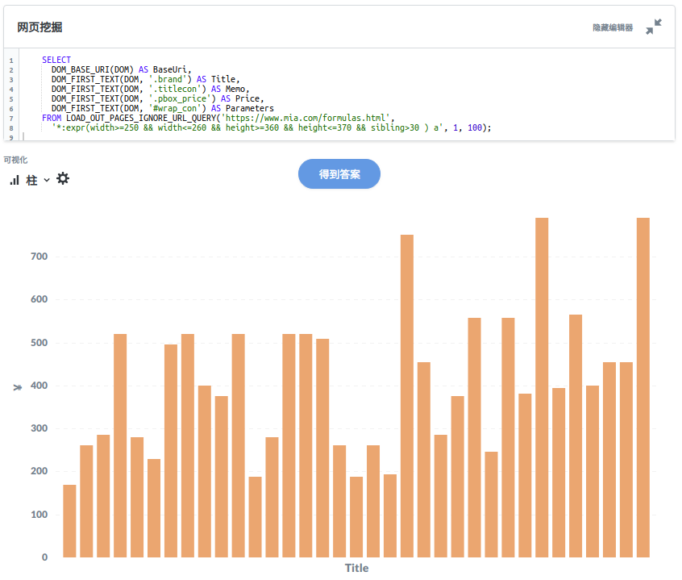

Pulsar README
===================
Pulsar is an un-structure focused intelligent data processing system, 
it extends SQL to handle the entire life cycle of data processing:
collection, extraction, analysis, storage and BI, etc.

[中文文档](README.zh.md)

# Features
- X-SQL: Do all data jobs using SQL
- BI Integration: Turn Web sites into tables and charts using just one simple SQL
- Ajax support: Access the Web automatically, behave like humans
- Web site monitoring: monitor news sites, e-commerce sites out-of-box
- Highly extensible and scalable: runs on Hadoop/Spark, and other big data infrastructure
- Various database support: Store data in your favourite database, MongoDB/HBase, etc

For more information check out [platonic.fun](platonic.fun)

## X-SQL
Extract data from a single page:

    SELECT
        DOM_TEXT(DOM) AS TITLE,
        DOM_ABS_HREF(DOM) AS LINK
    FROM
        LOAD_AND_SELECT('https://en.wikipedia.org/wiki/Topology', '.references a.external');

The SQL above downloads a Web page from wikipedia, find out the references section and extract all external reference links.

Extract data from a batch of pages, and turn them into a table:

    SELECT
      DOM_BASE_URI(DOM) AS BaseUri,
      DOM_FIRST_TEXT(DOM, '.brand') AS Title,
      DOM_FIRST_TEXT(DOM, '.titlecon') AS Memo,
      DOM_FIRST_TEXT(DOM, '.pbox_price') AS Price,
      DOM_FIRST_TEXT(DOM, '#wrap_con') AS Parameters
    FROM LOAD_OUT_PAGES_IGNORE_URL_QUERY('https://www.mia.com/formulas.html', '*:expr(width>=250 && width<=260 && height>=360 && height<=370 && sibling>30 ) a', 1, 100);

The SQL above visits an index page in mia.com, download detail pages and then extract data from them.

You can clone a copy of Pulsar code and run the SQLs yourself, or run them from our [online demo](http://bi.platonic.fun/question/new).

Check [sql-history.sql](https://github.com/platonai/pulsar/blob/master/sql-history.sql) to see more example SQLs. All SQL functions can be found under [ai.platon.pulsar.ql.h2.udfs](https://github.com/platonai/pulsar/tree/master/pulsar-ql-server/src/main/kotlin/fun/platonic/pulsar/ql/h2/udfs).

## BI Integration
Use the customized [Metabase](https://github.com/platonai/metabase) to write X-SQLs and turn 
Web sites into tables and charts immediately.
Everyone in your company can ask questions and learn from WEB DATA now, for the first time.

# Build & Run
## Install dependencies
    bin/tools/install-depends.sh
## Build from source
    git clone git@github.com:platonai/pulsar.git
    cd pulsar && mvn -Pthird -Pplugins
## Install mongodb
You can skip this step, in such case, all data will lose after pulsar shutdown.
Ubuntu/Debian:

    sudo apt-get install mongodb
## Start the pulsar server
    bin/pulsar
## Use Web console
Web console [http://localhost:8082](http://localhost:8082) is already open in your browser now, enjoy playing with X-SQL.
## Execute a single X-SQL
    bin/pulsar sql -sql "SELECT DOM_TEXT(DOM) AS TITLE, DOM_ABS_HREF(DOM) AS LINK FROM LOAD_AND_SELECT('https://en.wikipedia.org/wiki/Topology', '.references a.external')"
## Use GUI-free console
    bin/pulsar sql

## Use advanced BI tool
Download [Metabase](https://github.com/platonai/metabase) X-SQL edition, and run:

    java -jar metabase.jar

# Large scale Web spider
Crawl the open Web from seeds, and index text content using solr, run script:

    -- coming soon ..
    bin/crawl.sh default false awesome_crawl_task http://localhost:8983/solr/awesome_crawl_task/ 1

# Enterprise Edition:

Pulsar Enterprise Edition supports Auto Web Mining: unsupervised machine learning, no rules or training required, 
turn Web sites into tables automatically. Here are some examples: [Auto Web Mining Examples](http://bi.platonic.fun/question/20)
