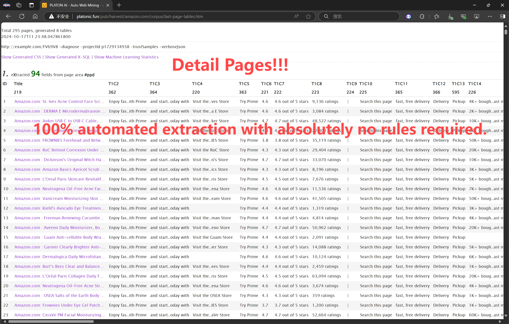

# 🤖 Browser4

[](https://hub.docker.com/r/galaxyeye88/browser4)
[](https://github.com/platonai/browser4/blob/main/LICENSE)
[](https://spring.io/projects/spring-boot)

---

English | [简体中文](README-CN.md) | [中国镜像](https://gitee.com/platonai_galaxyeye/Browser4)

<!-- TOC -->
**Table of Contents**
- [🤖 Browser4](#-browser4)
    - [🌟 Introduction](#-introduction)
        - [✨ Key Capabilities](#-key-capabilities)
    - [🎥 Demo Videos](#-demo-videos)
    - [🚀 Quick Start](#-quick-start)
    - [💡 Usage Examples](#-usage-examples)
        - [Browser Agents](#browser-agents)
        - [Workflow Automation](#workflow-automation)
        - [LLM + X-SQL](#llm--x-sql)
        - [High-Speed Parallel Processing](#high-speed-parallel-processing)
        - [Auto Extraction](#auto-extraction)
    - [📦 Modules Overview](#-modules-overview)
    - [📜 Documentation](#-documentation)
    - [🔧 Proxies - Unblock Websites](#-proxies---unblock-websites)
    - [✨ Features](#-features)
    - [🤝 Support & Community](#-support--community)
<!-- /TOC -->

## 🌟 Introduction

💖 **Browser4: a lightning-fast, coroutine-safe browser engine for AI automation** 💖

### ✨ Key Capabilities

* 👽 **Browser Agents** — Autonomous agents that reason, plan, and act within the browser.
* 🤖 **Browser Automation** — High-performance automation for workflows, navigation, and data extraction.
* ⚡  **Extreme Performance** — Fully coroutine-safe; supports 100k+ page visits per machine per day.
* 🧠 **Web Understanding** — Deep understanding of dynamic, script-driven, and interactive web pages.
* 📊 **Data Extraction APIs** — Robust APIs for extracting structured data with minimal effort.

---

## 🎥 Demo Videos

🎬 YouTube:
[](https://www.youtube.com/watch?v=_BcryqWzVMI)

📺 Bilibili:
[https://www.bilibili.com/video/BV1kM2rYrEFC](https://www.bilibili.com/video/BV1kM2rYrEFC)

---

## 🚀 Quick Start

**Prerequisites**: Java 17+ and Maven 3.6+

1. **Clone the repository**
   ```shell
   git clone https://github.com/platonai/browser4.git
   cd browser4
   ```

2. **Configure your LLM API key**

   > Edit [application.properties](application.properties) and add your API key.

3. **Build the project**
   ```shell
   ./mvnw -q -DskipTests
   ```

4. **Run examples**
   ```shell
   ./mvnw -pl pulsar-examples exec:java -D"exec.mainClass=ai.platon.pulsar.examples.agent.Browser4AgentKt"
   ```
   If you have encoding problem on Windows:
   ```shell
   ./bin/run-examples.ps1
   ```

   Explore and run examples in the `pulsar-examples` module to see Browser4 in action.

For Docker deployment, see our [Docker Hub repository](https://hub.docker.com/r/galaxyeye88/browser4).

---

## 💡 Usage Examples

### Browser Agents

Autonomous agents that understand natural language instructions and execute complex browser workflows.

```kotlin
val agent = AgenticContexts.getOrCreateAgent()

val task = """
    1. go to amazon.com
    2. search for pens to draw on whiteboards
    3. compare the first 4 ones
    4. write the result to a markdown file
    """

agent.run(task)
```

### Workflow Automation

Low-level browser automation & data extraction with fine-grained control.

**Features:**
- Direct and full Chrome DevTools Protocol (CDP) control, coroutine safe
- Precise element interactions (click, scroll, input)
- Fast data extraction using CSS selectors/XPath

```kotlin
val session = AgenticContexts.getOrCreateSession()
val agent = session.companionAgent
val driver = session.getOrCreateBoundDriver()

// Open and parse a page
var page = session.open(url)
var document = session.parse(page)
var fields = session.extract(document, mapOf("title" to "#title"))

// Interact with the page
var result = agent.act("scroll to the comment section")
var content = driver.selectFirstTextOrNull("#comments")

// Complex agent tasks
var history = agent.run("Search for 'smart phone', read the first four products, and give me a comparison.")

// Capture and extract from current state
page = session.capture(driver)
document = session.parse(page)
fields = session.extract(document, mapOf("ratings" to "#ratings"))
```

### LLM + X-SQL

Ideal for high-complexity data-extraction pipelines with multiple-dozen entities and several hundred fields per entity.

**Benefits:**
- Extract 10x more entities and 100x more fields compared to traditional methods
- Combine LLM intelligence with precise CSS selectors/XPath
- SQL-like syntax for familiar data queries

```kotlin
val context = AgenticContexts.create()
val sql = """
select
  llm_extract(dom, 'product name, price, ratings') as llm_extracted_data,
  dom_first_text(dom, '#productTitle') as title,
  dom_first_text(dom, '#bylineInfo') as brand,
  dom_first_text(dom, '#price tr td:matches(^Price) ~ td, #corePrice_desktop tr td:matches(^Price) ~ td') as price,
  dom_first_text(dom, '#acrCustomerReviewText') as ratings,
  str_first_float(dom_first_text(dom, '#reviewsMedley .AverageCustomerReviews span:contains(out of)'), 0.0) as score
from load_and_select('https://www.amazon.com/dp/B08PP5MSVB -i 1s -njr 3', 'body');
"""
val rs = context.executeQuery(sql)
println(ResultSetFormatter(rs, withHeader = true))
```

Example code:

* [X-SQL to scrape 100+ fields from an Amazon's product page](https://github.com/platonai/exotic-amazon/tree/main/src/main/resources/sites/amazon/crawl/parse/sql/crawl)
* [X-SQLs to crawl all types of Amazon webpages](https://github.com/platonai/exotic-amazon/tree/main/src/main/resources/sites/amazon/crawl/parse/sql/crawl)


### High-Speed Parallel Processing

Achieve extreme throughput with parallel browser control and smart resource optimization.

**Performance:**
- 100,000+ page visits per machine per day
- Concurrent session management
- Resource blocking for faster page loads

```kotlin
val args = "-refresh -dropContent -interactLevel fastest"
val blockingUrls = listOf("*.png", "*.jpg")
val links = LinkExtractors.fromResource("urls.txt")
    .map { ListenableHyperlink(it, "", args = args) }
    .onEach {
        it.eventHandlers.browseEventHandlers.onWillNavigate.addLast { page, driver ->
            driver.addBlockedURLs(blockingUrls)
        }
    }

session.submitAll(links)
```

🎬 YouTube:
[](https://www.youtube.com/watch?v=_BcryqWzVMI)

📺 Bilibili:
[https://www.bilibili.com/video/BV1kM2rYrEFC](https://www.bilibili.com/video/BV1kM2rYrEFC)


---

### Auto Extraction

Automatic, large-scale, high-precision field discovery and extraction powered by self-/unsupervised machine learning — no LLM API calls, no tokens, deterministic and fast.

**What it does:**
- Learns every extractable field on item/detail pages (often dozens to hundreds) with high precision.

**Why not just LLMs?**
- LLM extraction adds latency, cost, and token limits.
- ML-based auto extraction is local, reproducible, and scalable to 100k+ pages/day.
- You can still combine both: use Auto Extraction for structured baseline + LLM for semantic enrichment.

**Quick Commands (PulsarRPAPro):**
```bash
curl -L -o PulsarRPAPro.jar https://github.com/platonai/PulsarRPAPro/releases/download/v3.0.0/PulsarRPAPro.jar
```

**Integration Status:**
- Available today via the companion project [PulsarRPAPro](https://github.com/platonai/PulsarRPAPro).
- Native Browser4 API exposure is planned; follow releases for updates.

**Key Advantages:**
- High precision: >95% fields discovered; majority with >99% accuracy (indicative on tested domains).
- Resilient to selector churn & HTML noise.
- Zero external dependency (no API key) → cost-efficient at scale.
- Explainable: generated selectors & SQL are transparent and auditable.

👽 Extract data with machine learning agents:



(Coming soon: richer in-repo examples and direct API hooks.)

---

## 📦 Modules Overview

| Module | Description |
|--------|-------------|
| `pulsar-core` | Core engine: sessions, scheduling, DOM, browser control |
| `pulsar-rest` | Spring Boot REST layer & command endpoints |
| `pulsar-client` | Client SDK / CLI utilities |
| `browser4-spa` | Single Page Application for browser agents |
| `browser4-agents` | Agent & crawler orchestration with product packaging |
| `pulsar-tests` | Heavy integration & scenario tests |
| `pulsar-tests-common` | Shared test utilities & fixtures |

---

## 📜 Documentation

* 🛠️ [Configuration Guide](docs/config.md)
* 📚 [Build from Source](docs/build.md)
* 🧠 [Expert Guide](docs/advanced-guides.md)

---

## 🔧 Proxies - Unblock Websites

<details>

Set the environment variable PROXY_ROTATION_URL to the URL provided by your proxy service:

```shell
export PROXY_ROTATION_URL=https://your-proxy-provider.com/rotation-endpoint
```

Each time the rotation URL is accessed, it should return a response containing one or more fresh proxy IPs.
Ask your proxy provider for such a URL.

</details>

---

## ✨ Features

### AI & Agents
- Problem-solving autonomous browser agents
- Parallel agent sessions
- LLM-assisted page understanding & extraction

### Browser Automation & RPA
- Workflow-based browser actions
- Precise coroutine-safe control (scroll, click, extract)
- Flexible event handlers & lifecycle management

### Data Extraction & Query
- One-line data extraction commands
- X-SQL extended query language for DOM/content
- Structured + unstructured hybrid extraction (LLM + selectors)

### Performance & Scalability
- High-efficiency parallel page rendering
- Block-resistant design & smart retries
- 100,000+ pages/day on modest hardware (indicative)

### Stealth & Reliability
- Advanced anti-bot techniques
- IP & profile rotation
- Resilient scheduling & quality assurance

### Developer Experience
- Simple API integration (REST, native, text commands)
- Rich configuration layering
- Clear structured logging & metrics

### Storage & Monitoring
- Local FS & MongoDB support (extensible)
- Comprehensive logs & transparency
- Detailed metrics & lifecycle visibility

---

## 🤝 Support & Community

- 💬 WeChat: galaxyeye
- 🌐 Weibo: [galaxyeye](https://weibo.com/galaxyeye)
- 📧 Email: galaxyeye@live.cn, ivincent.zhang@gmail.com
- 🐦 Twitter: galaxyeye8
- 🌍 Website: [platon.ai](https://platon.ai)

<div style="display: flex;">
  
</div>

---

> For Chinese documentation, refer to [简体中文 README](README-CN.md).
