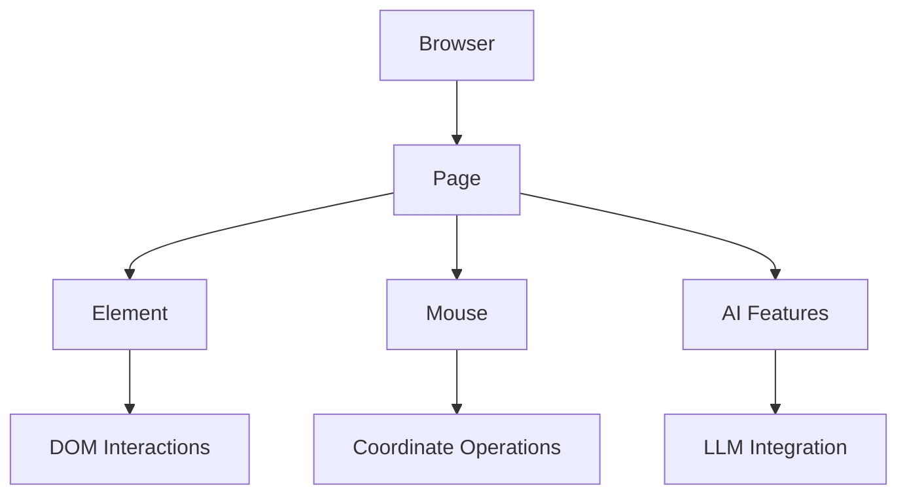

# All Parameters
Source: https://docs.browser-use.com/customize/actor/all-parameters

Complete API reference for Browser Actor classes, methods, and parameters including BrowserSession, Page, Element, and Mouse

## Browser (BrowserSession)

Main browser session manager.

### Key Methods

```python  theme={null}
from browser_use import Browser

browser = Browser()
await browser.start()

# Page management
page = await browser.new_page("https://example.com")
pages = await browser.get_pages()
current = await browser.get_current_page()
await browser.close_page(page)

# To stop the browser session
await browser.stop()
```

### Constructor Parameters

See [Browser Parameters](../browser/all-parameters) for complete configuration options.

## Page

Browser tab/iframe for page-level operations.

### Navigation

* `goto(url: str)` - Navigate to URL
* `go_back()`, `go_forward()`, `reload()` - History navigation

### Element Finding

* `get_elements_by_css_selector(selector: str) -> list[Element]` - CSS selector
* `get_element(backend_node_id: int) -> Element` - By CDP node ID
* `get_element_by_prompt(prompt: str, llm) -> Element | None` - AI-powered
* `must_get_element_by_prompt(prompt: str, llm) -> Element` - AI (raises if not found)

### JavaScript & Controls

* `evaluate(page_function: str, *args) -> str` - Execute JS (arrow function format)
* `press(key: str)` - Send keyboard input ("Enter", "Control+A")
* `set_viewport_size(width: int, height: int)` - Set viewport
* `screenshot(format='jpeg', quality=None) -> str` - Take screenshot

### Information

* `get_url() -> str`, `get_title() -> str` - Page info
* `mouse -> Mouse` - Get mouse interface

### AI Features

* `extract_content(prompt: str, structured_output: type[T], llm) -> T` - Extract data

## Element

Individual DOM element interactions.

### Interactions

* `click(button='left', click_count=1, modifiers=None)` - Click element
* `fill(text: str, clear=True)` - Fill input
* `hover()`, `focus()` - Mouse/focus actions
* `check()` - Toggle checkbox/radio
* `select_option(values: str | list[str])` - Select dropdown options
* `drag_to(target: Element | Position)` - Drag and drop

### Properties

* `get_attribute(name: str) -> str | None` - Get attribute
* `get_bounding_box() -> BoundingBox | None` - Position/size
* `get_basic_info() -> ElementInfo` - Complete element info
* `screenshot(format='jpeg') -> str` - Element screenshot

## Mouse

Coordinate-based mouse operations.

### Operations

* `click(x: int, y: int, button='left', click_count=1)` - Click at coordinates
* `move(x: int, y: int, steps=1)` - Move mouse
* `down(button='left')`, `up(button='left')` - Press/release buttons
* `scroll(x=0, y=0, delta_x=None, delta_y=None)` - Scroll at coordinates


# Basics
Source: https://docs.browser-use.com/customize/actor/basics

Low-level Playwright-like browser automation with direct and full CDP control and precise element interactions

## Core Architecture



### Core Classes

* **Browser** (alias: **BrowserSession**): Main session manager
* **Page**: Represents a browser tab/iframe
* **Element**: Individual DOM element operations
* **Mouse**: Coordinate-based mouse operations

## Basic Usage

```python  theme={null}
from browser_use import Browser, Agent
from browser_use.llm.openai import ChatOpenAI

async def main():
    llm = ChatOpenAI(api_key="your-api-key")
    browser = Browser()
    await browser.start()

    # 1. Actor: Precise navigation and element interactions
    page = await browser.new_page("https://github.com/login")
    email_input = await page.must_get_element_by_prompt("username field", llm=llm)
    await email_input.fill("your-username")

    # 2. Agent: AI-driven complex tasks
    agent = Agent(browser=browser, llm=llm)
    await agent.run("Complete login and navigate to my repositories")

    await browser.stop()
```

## Important Notes

* **Not Playwright**: Actor is built on CDP, not Playwright. The API resembles Playwright as much as possible for easy migration, but is sorta subset.
* **Immediate Returns**: `get_elements_by_css_selector()` doesn't wait for visibility
* **Manual Timing**: You handle navigation timing and waiting
* **JavaScript Format**: `evaluate()` requires arrow function format: `() => {}`


# Examples
Source: https://docs.browser-use.com/customize/actor/examples

Comprehensive examples for Browser Actor automation tasks including forms, JavaScript, mouse operations, and AI features

## Page Management

```python  theme={null}
from browser_use import Browser

browser = Browser()
await browser.start()

# Create pages
page = await browser.new_page()  # Blank tab
page = await browser.new_page("https://example.com")  # With URL

# Get all pages
pages = await browser.get_pages()
current = await browser.get_current_page()

# Close page
await browser.close_page(page)
await browser.stop()
```

## Element Finding & Interactions

```python  theme={null}
page = await browser.new_page('https://github.com')

# CSS selectors (immediate return)
elements = await page.get_elements_by_css_selector("input[type='text']")
buttons = await page.get_elements_by_css_selector("button.submit")

# Element actions
await elements[0].click()
await elements[0].fill("Hello World")
await elements[0].hover()

# Page actions
await page.press("Enter")
screenshot = await page.screenshot()
```

## LLM-Powered Features

```python  theme={null}
from browser_use.llm.openai import ChatOpenAI
from pydantic import BaseModel

llm = ChatOpenAI(api_key="your-api-key")

# Find elements using natural language
button = await page.get_element_by_prompt("login button", llm=llm)
await button.click()

# Extract structured data
class ProductInfo(BaseModel):
    name: str
    price: float

product = await page.extract_content(
    "Extract product name and price",
    ProductInfo,
    llm=llm
)
```

## JavaScript Execution

```python  theme={null}
# Simple JavaScript evaluation
title = await page.evaluate('() => document.title')

# JavaScript with arguments
result = await page.evaluate('(x, y) => x + y', 10, 20)

# Complex operations
stats = await page.evaluate('''() => ({
    url: location.href,
    links: document.querySelectorAll('a').length
})''')
```

## Mouse Operations

```python  theme={null}
mouse = await page.mouse

# Click at coordinates
await mouse.click(x=100, y=200)

# Drag and drop
await mouse.down()
await mouse.move(x=500, y=600)
await mouse.up()

# Scroll
await mouse.scroll(x=0, y=100, delta_y=-500)
```

## Best Practices

* Use `asyncio.sleep()` after actions that trigger navigation
* Check URL/title changes to verify state transitions
* Always check if elements exist before interaction
* Implement retry logic for flaky elements
* Call `browser.stop()` to clean up resources


# All Parameters
Source: https://docs.browser-use.com/customize/agent/all-parameters

Complete reference for all agent configuration options

## Available Parameters

### Core Settings

* `tools`: Registry of <a href="../tools/available">tools</a> the agent can call. <a href="../tools/basics">Example</a>
* `browser`: Browser object where you can specify the browser settings.
* `output_model_schema`: Pydantic model class for structured output validation. [Example](https://github.com/browser-use/browser-use/blob/main/examples/features/custom_output.py)

### Vision & Processing

* `use_vision` (default: `"auto"`): Vision mode - `"auto"` includes screenshot tool but only uses vision when requested, `True` always includes screenshots, `False` never includes screenshots and excludes screenshot tool
* `vision_detail_level` (default: `'auto'`): Screenshot detail level - `'low'`, `'high'`, or `'auto'`
* `page_extraction_llm`: Separate LLM model for page content extraction. You can choose a small & fast model because it only needs to extract text from the page (default: same as `llm`)

### Actions & Behavior

* `initial_actions`: List of actions to run before the main task without LLM. [Example](https://github.com/browser-use/browser-use/blob/main/examples/features/initial_actions.py)
* `max_actions_per_step` (default: `4`): Maximum actions per step, e.g. for form filling the agent can output 4 fields at once. We execute the actions until the page changes.
* `max_failures` (default: `3`): Maximum retries for steps with errors
* `final_response_after_failure` (default: `True`): If True, attempt to force one final model call with intermediate output after max\_failures is reached
* `use_thinking` (default: `True`): Controls whether the agent uses its internal "thinking" field for explicit reasoning steps.
* `flash_mode` (default: `False`): Fast mode that skips evaluation, next goal and thinking and only uses memory. If `flash_mode` is enabled, it overrides `use_thinking` and disables the thinking process entirely. [Example](https://github.com/browser-use/browser-use/blob/main/examples/getting_started/05_fast_agent.py)

### System Messages

* `override_system_message`: Completely replace the default system prompt.
* `extend_system_message`: Add additional instructions to the default system prompt. [Example](https://github.com/browser-use/browser-use/blob/main/examples/features/custom_system_prompt.py)

### File & Data Management

* `save_conversation_path`: Path to save complete conversation history
* `save_conversation_path_encoding` (default: `'utf-8'`): Encoding for saved conversations
* `available_file_paths`: List of file paths the agent can access
* `sensitive_data`: Dictionary of sensitive data to handle carefully. [Example](https://github.com/browser-use/browser-use/blob/main/examples/features/sensitive_data.py)

### Visual Output

* `generate_gif` (default: `False`): Generate GIF of agent actions. Set to `True` or string path
* `include_attributes`: List of HTML attributes to include in page analysis

### Performance & Limits

* `max_history_items`: Maximum number of last steps to keep in the LLM memory. If `None`, we keep all steps.
* `llm_timeout` (default: `90`): Timeout in seconds for LLM calls
* `step_timeout` (default: `120`): Timeout in seconds for each step
* `directly_open_url` (default: `True`): If we detect a url in the task, we directly open it.

### Advanced Options

* `calculate_cost` (default: `False`): Calculate and track API costs
* `display_files_in_done_text` (default: `True`): Show file information in completion messages

### Backwards Compatibility

* `controller`: Alias for `tools` for backwards compatibility.
* `browser_session`: Alias for `browser` for backwards compatibility.


# Basics
Source: https://docs.browser-use.com/customize/agent/basics


```python  theme={null}
from browser_use import Agent, ChatBrowserUse

agent = Agent(
    task="Search for latest news about AI",
    llm=ChatBrowserUse(),
)

async def main():
    history = await agent.run(max_steps=100)
```

* `task`: The task you want to automate.
* `llm`: Your favorite LLM. See <a href="/customize/supported-models">Supported Models</a>.

The agent is executed using the async `run()` method:

* `max_steps` (default: `100`): Maximum number of steps an agent can take.

Check out all customizable parameters <a href="/customize/agent/all-parameters"> here</a>.


# Output Format
Source: https://docs.browser-use.com/customize/agent/output-format


## Agent History

The `run()` method returns an `AgentHistoryList` object with the complete execution history:

```python  theme={null}
history = await agent.run()

# Access useful information
history.urls()                    # List of visited URLs
history.screenshot_paths()        # List of screenshot paths
history.screenshots()             # List of screenshots as base64 strings
history.action_names()            # Names of executed actions
history.extracted_content()       # List of extracted content from all actions
history.errors()                  # List of errors (with None for steps without errors)
history.model_actions()           # All actions with their parameters
history.model_outputs()           # All model outputs from history
history.last_action()             # Last action in history

# Analysis methods
history.final_result()            # Get the final extracted content (last step)
history.is_done()                 # Check if agent completed successfully
history.is_successful()           # Check if agent completed successfully (returns None if not done)
history.has_errors()              # Check if any errors occurred
history.model_thoughts()          # Get the agent's reasoning process (AgentBrain objects)
history.action_results()          # Get all ActionResult objects from history
history.action_history()          # Get truncated action history with essential fields
history.number_of_steps()         # Get the number of steps in the history
history.total_duration_seconds()  # Get total duration of all steps in seconds

# Structured output (when using output_model_schema)
history.structured_output         # Property that returns parsed structured output
```

See all helper methods in the [AgentHistoryList source code](https://github.com/browser-use/browser-use/blob/main/browser_use/agent/views.py#L301).

## Structured Output

For structured output, use the `output_model_schema` parameter with a Pydantic model. [Example](https://github.com/browser-use/browser-use/blob/main/examples/features/custom_output.py).


# Prompting Guide
Source: https://docs.browser-use.com/customize/agent/prompting-guide

Tips and tricks

Prompting can drastically improve performance and solve existing limitations of the library.

### 1. Be Specific vs Open-Ended

**✅ Specific (Recommended)**

```python  theme={null}
task = """
1. Go to https://quotes.toscrape.com/
2. Use extract action with the query "first 3 quotes with their authors"
3. Save results to quotes.csv using write_file action
4. Do a google search for the first quote and find when it was written
"""
```

**❌ Open-Ended**

```python  theme={null}
task = "Go to web and make money"
```

### 2. Name Actions Directly

When you know exactly what the agent should do, reference actions by name:

```python  theme={null}
task = """
1. Use search action to find "Python tutorials"
2. Use click to open first result in a new tab
3. Use scroll action to scroll down 2 pages
4. Use extract to extract the names of the first 5 items
5. Wait for 2 seconds if the page is not loaded, refresh it and wait 10 sec
6. Use send_keys action with "Tab Tab ArrowDown Enter"
"""
```

See [Available Tools](/customize/tools/available) for the complete list of actions.

### 3. Handle interaction problems via keyboard navigation

Sometimes buttons can't be clicked (you found a bug in the library - open an issue).
Good news - often you can work around it with keyboard navigation!

```python  theme={null}
task = """
If the submit button cannot be clicked:
1. Use send_keys action with "Tab Tab Enter" to navigate and activate
2. Or use send_keys with "ArrowDown ArrowDown Enter" for form submission
"""
```

### 4. Custom Actions Integration

```python  theme={null}
# When you have custom actions
@controller.action("Get 2FA code from authenticator app")
async def get_2fa_code():
    # Your implementation
    pass

task = """
Login with 2FA:
1. Enter username/password
2. When prompted for 2FA, use get_2fa_code action
3. NEVER try to extract 2FA codes from the page manually
4. ALWAYS use the get_2fa_code action for authentication codes
"""
```

### 5. Error Recovery

```python  theme={null}
task = """
Robust data extraction:
1. Go to openai.com to find their CEO
2. If navigation fails due to anti-bot protection:
   - Use google search to find the CEO
3. If page times out, use go_back and try alternative approach
"""
```

The key to effective prompting is being specific about actions.


# All Parameters
Source: https://docs.browser-use.com/customize/browser/all-parameters

Complete reference for all browser configuration options

<Note>
  The `Browser` instance also provides all [Actor](/customize/actor/all-parameters) methods for direct browser control (page management, element interactions, etc.).
</Note>

## Core Settings

* `cdp_url`: CDP URL for connecting to existing browser instance (e.g., `"http://localhost:9222"`)

## Display & Appearance

* `headless` (default: `None`): Run browser without UI. Auto-detects based on display availability (`True`/`False`/`None`)
* `window_size`: Browser window size for headful mode. Use dict `{'width': 1920, 'height': 1080}` or `ViewportSize` object
* `window_position` (default: `{'width': 0, 'height': 0}`): Window position from top-left corner in pixels
* `viewport`: Content area size, same format as `window_size`. Use `{'width': 1280, 'height': 720}` or `ViewportSize` object
* `no_viewport` (default: `None`): Disable viewport emulation, content fits to window size
* `device_scale_factor`: Device scale factor (DPI). Set to `2.0` or `3.0` for high-resolution screenshots

## Browser Behavior

* `keep_alive` (default: `None`): Keep browser running after agent completes
* `allowed_domains`: Restrict navigation to specific domains. Domain pattern formats:
  * `'example.com'` - Matches only `https://example.com/*`
  * `'*.example.com'` - Matches `https://example.com/*` and any subdomain `https://*.example.com/*`
  * `'http*://example.com'` - Matches both `http://` and `https://` protocols
  * `'chrome-extension://*'` - Matches any Chrome extension URL
  * **Security**: Wildcards in TLD (e.g., `example.*`) are **not allowed** for security
  * Use list like `['*.google.com', 'https://example.com', 'chrome-extension://*']`
  * **Performance**: Lists with 100+ domains are automatically optimized to sets for O(1) lookup. Pattern matching is disabled for optimized lists. Both `www.example.com` and `example.com` variants are checked automatically.
* `prohibited_domains`: Block navigation to specific domains. Uses same pattern formats as `allowed_domains`. When both `allowed_domains` and `prohibited_domains` are set, `allowed_domains` takes precedence. Examples:
  * `['pornhub.com', '*.gambling-site.net']` - Block specific sites and all subdomains
  * `['https://explicit-content.org']` - Block specific protocol/domain combination
  * **Performance**: Lists with 100+ domains are automatically optimized to sets for O(1) lookup (same as `allowed_domains`)
* `enable_default_extensions` (default: `True`): Load automation extensions (uBlock Origin, cookie handlers, ClearURLs)
* `cross_origin_iframes` (default: `False`): Enable cross-origin iframe support (may cause complexity)
* `is_local` (default: `True`): Whether this is a local browser instance. Set to `False` for remote browsers. If we have a `executable_path` set, it will be automatically set to `True`. This can effect your download behavior.

## User Data & Profiles

* `user_data_dir` (default: auto-generated temp): Directory for browser profile data. Use `None` for incognito mode
* `profile_directory` (default: `'Default'`): Chrome profile subdirectory name (`'Profile 1'`, `'Work Profile'`, etc.)
* `storage_state`: Browser storage state (cookies, localStorage). Can be file path string or dict object

## Network & Security

* `proxy`: Proxy configuration using `ProxySettings(server='http://host:8080', bypass='localhost,127.0.0.1', username='user', password='pass')`

* `permissions` (default: `['clipboardReadWrite', 'notifications']`): Browser permissions to grant. Use list like `['camera', 'microphone', 'geolocation']`

* `headers`: Additional HTTP headers for connect requests (remote browsers only)

## Browser Launch

* `executable_path`: Path to browser executable for custom installations. Platform examples:
  * macOS: `'/Applications/Google Chrome.app/Contents/MacOS/Google Chrome'`
  * Windows: `'C:\\Program Files\\Google\\Chrome\\Application\\chrome.exe'`
  * Linux: `'/usr/bin/google-chrome'`
* `channel`: Browser channel (`'chromium'`, `'chrome'`, `'chrome-beta'`, `'msedge'`, etc.)
* `args`: Additional command-line arguments for the browser. Use list format: `['--disable-gpu', '--custom-flag=value', '--another-flag']`
* `env`: Environment variables for browser process. Use dict like `{'DISPLAY': ':0', 'LANG': 'en_US.UTF-8', 'CUSTOM_VAR': 'test'}`
* `chromium_sandbox` (default: `True` except in Docker): Enable Chromium sandboxing for security
* `devtools` (default: `False`): Open DevTools panel automatically (requires `headless=False`)
* `ignore_default_args`: List of default args to disable, or `True` to disable all. Use list like `['--enable-automation', '--disable-extensions']`

## Timing & Performance

* `minimum_wait_page_load_time` (default: `0.25`): Minimum time to wait before capturing page state in seconds
* `wait_for_network_idle_page_load_time` (default: `0.5`): Time to wait for network activity to cease in seconds
* `wait_between_actions` (default: `0.5`): Time to wait between agent actions in seconds

## AI Integration

* `highlight_elements` (default: `True`): Highlight interactive elements for AI vision
* `paint_order_filtering` (default: `True`): Enable paint order filtering to optimize DOM tree by removing elements hidden behind others. Slightly experimental

## Downloads & Files

* `accept_downloads` (default: `True`): Automatically accept all downloads
* `downloads_path`: Directory for downloaded files. Use string like `'./downloads'` or `Path` object
* `auto_download_pdfs` (default: `True`): Automatically download PDFs instead of viewing in browser

## Device Emulation

* `user_agent`: Custom user agent string. Example: `'Mozilla/5.0 (iPhone; CPU iPhone OS 14_0 like Mac OS X)'`
* `screen`: Screen size information, same format as `window_size`

## Recording & Debugging

* `record_video_dir`: Directory to save video recordings as `.mp4` files
* `record_video_size` (default: `ViewportSize`): The frame size (width, height) of the video recording.
* `record_video_framerate` (default: `30`): The framerate to use for the video recording.
* `record_har_path`: Path to save network trace files as `.har` format
* `traces_dir`: Directory to save complete trace files for debugging
* `record_har_content` (default: `'embed'`): HAR content mode (`'omit'`, `'embed'`, `'attach'`)
* `record_har_mode` (default: `'full'`): HAR recording mode (`'full'`, `'minimal'`)

## Advanced Options

* `disable_security` (default: `False`): ⚠️ **NOT RECOMMENDED** - Disables all browser security features
* `deterministic_rendering` (default: `False`): ⚠️ **NOT RECOMMENDED** - Forces consistent rendering but reduces performance

***

## Outdated BrowserProfile

For backward compatibility, you can pass all the parameters from above to the `BrowserProfile` and then to the `Browser`.

```python  theme={null}
from browser_use import BrowserProfile
profile = BrowserProfile(headless=False)
browser = Browser(browser_profile=profile)
```

## Browser vs BrowserSession

`Browser` is an alias for `BrowserSession` - they are exactly the same class:
Use `Browser` for cleaner, more intuitive code.


# Basics
Source: https://docs.browser-use.com/customize/browser/basics


***

```python  theme={null}
from browser_use import Agent, Browser, ChatBrowserUse

browser = Browser(
	headless=False,  # Show browser window
	window_size={'width': 1000, 'height': 700},  # Set window size
)

agent = Agent(
	task='Search for Browser Use',
	browser=browser,
	llm=ChatBrowserUse(),
)


async def main():
	await agent.run()
```


# Real Browser
Source: https://docs.browser-use.com/customize/browser/real-browser


Connect your existing Chrome browser to preserve authentication.

## Basic Example

```python  theme={null}
from browser_use import Agent, Browser, ChatOpenAI

# Connect to your existing Chrome browser
browser = Browser(
    executable_path='/Applications/Google Chrome.app/Contents/MacOS/Google Chrome',
    user_data_dir='~/Library/Application Support/Google/Chrome',
    profile_directory='Default',
)

agent = Agent(
    task='Visit https://duckduckgo.com and search for "browser-use founders"',
    browser=browser,
    llm=ChatOpenAI(model='gpt-4.1-mini'),
)
async def main():
	await agent.run()
```

> **Note:** You need to fully close chrome before running this example. Also, Google blocks this approach currently so we use DuckDuckGo instead.

## How it Works

1. **`executable_path`** - Path to your Chrome installation
2. **`user_data_dir`** - Your Chrome profile folder (keeps cookies, extensions, bookmarks)
3. **`profile_directory`** - Specific profile name (Default, Profile 1, etc.)

## Platform Paths

```python  theme={null}
# macOS
executable_path='/Applications/Google Chrome.app/Contents/MacOS/Google Chrome'
user_data_dir='~/Library/Application Support/Google/Chrome'

# Windows
executable_path='C:\\Program Files\\Google\\Chrome\\Application\\chrome.exe'
user_data_dir='%LOCALAPPDATA%\\Google\\Chrome\\User Data'

# Linux
executable_path='/usr/bin/google-chrome'
user_data_dir='~/.config/google-chrome'
```


# Remote Browser
Source: https://docs.browser-use.com/customize/browser/remote


### Browser-Use Cloud Browser or CDP URL

The easiest way to use a cloud browser is with the built-in Browser-Use cloud service:

```python  theme={null}
from browser_use import Agent, Browser, ChatBrowserUse

# Simple: Use Browser-Use cloud browser service
browser = Browser(
    use_cloud=True,  # Automatically provisions a cloud browser
)

# Advanced: Configure cloud browser parameters
# Using this settings can bypass any captcha protection on any website
browser = Browser(
    cloud_profile_id='your-profile-id',  # Optional: specific browser profile
    cloud_proxy_country_code='us',  # Optional: proxy location (us, uk, fr, it, jp, au, de, fi, ca, in)
    cloud_timeout=30,  # Optional: session timeout in minutes (MAX free: 15min, paid: 240min)
)

# Or use a CDP URL from any cloud browser provider
browser = Browser(
    cdp_url="http://remote-server:9222"  # Get a CDP URL from any provider
)

agent = Agent(
    task="Your task here",
    llm=ChatBrowserUse(),
    browser=browser,
)
```

**Prerequisites:**

1. Get an API key from [cloud.browser-use.com](https://cloud.browser-use.com/new-api-key)
2. Set BROWSER\_USE\_API\_KEY environment variable

**Cloud Browser Parameters:**

* `cloud_profile_id`: UUID of a browser profile (optional, uses default if not specified)
* `cloud_proxy_country_code`: Country code for proxy location - supports: us, uk, fr, it, jp, au, de, fi, ca, in
* `cloud_timeout`: Session timeout in minutes (free users: max 15 min, paid users: max 240 min)

**Benefits:**

* ✅ No local browser setup required
* ✅ Scalable and fast cloud infrastructure
* ✅ Automatic provisioning and teardown
* ✅ Built-in authentication handling
* ✅ Optimized for browser automation
* ✅ Global proxy support for geo-restricted content

### Third-Party Cloud Browsers

You can pass in a CDP URL from any remote browser

### Proxy Connection

```python  theme={null}

from browser_use import Agent, Browser, ChatBrowserUse
from browser_use.browser import ProxySettings

browser = Browser(
    headless=False,
    proxy=ProxySettings(
        server="http://proxy-server:8080",
        username="proxy-user",
        password="proxy-pass"
    ),
    cdp_url="http://remote-server:9222"
)


agent = Agent(
    task="Your task here",
    llm=ChatBrowserUse(),
    browser=browser,
)
```


# All Parameters
Source: https://docs.browser-use.com/customize/code-agent/all-parameters

Complete reference for all CodeAgent configuration options

## CodeAgent Parameters

### Core Settings

* `task`: Task description string that defines what the agent should accomplish
* `llm`: LLM instance for code generation (required: ChatBrowserUse)
* `browser`: Browser session object for automation
* `tools`: Registry of tools the agent can call
* `max_steps` (default: `20`): Maximum number of execution steps before termination
* `max_failures` (default: `8`): Maximum consecutive errors before termination
* `max_validations` (default: `0`): Maximum number of times to run the validator agent (default: 0)

### Vision & Processing

* `use_vision` (default: `"auto"`): Vision mode - `"auto"` includes screenshot tool but only uses vision when requested, `True` always includes screenshots, `False` never includes screenshots and excludes screenshot tool
* `page_extraction_llm`: Separate LLM model for page content extraction. You can choose a small & fast model because it only needs to extract text from the page (default: same as `llm`)

### Actions & Behavior

* `use_thinking` (default: `True`): Controls whether the agent uses its internal "thinking" field for explicit reasoning steps

### File & Data Management

* `available_file_paths`: List of file paths the agent can access
* `sensitive_data`: Dictionary of sensitive data to handle carefully

### Advanced Options

* `calculate_cost` (default: `False`): Calculate and track API costs (see ... to track costs)


# Basics
Source: https://docs.browser-use.com/customize/code-agent/basics

Write Python code locally with browser automation

CodeAgent writes and executes Python code locally with browser automation capabilities. It's designed for repetitive data extraction tasks where the agent can write reusable functions.

<Warning>
  CodeAgent executes Python code on your local machine like Claude Code.
</Warning>

## Quick Start

```python  theme={null}
import asyncio
from browser_use import CodeAgent
from dotenv import load_dotenv

load_dotenv()

async def main():
    task = "Extract all products from example.com and save to products.csv"

    agent = CodeAgent(task=task)
    await agent.run()

asyncio.run(main())
```

```bash .env theme={null}
BROWSER_USE_API_KEY=your-api-key
```

<Note>
  CodeAgent currently only works with [ChatBrowserUse](https://chat.browser-use.com) which is optimized for this use case.
  Don't have one? We give you \$10 to try it out [here](https://cloud.browser-use.com/dashboard/api).
</Note>

## When to Use

**Best for:**

* Data extraction at scale (100s-1000s of items)
* Repetitive interactions where functions can be reused
* Tasks requiring data processing and file operations
* Deterministic workflows you want to rerun

**Performance:**

* Best performance for data collection tasks
* Slightly slower for one-off interactions vs standard Agent

**Output:**

* Generates Python code that can be rerun deterministically
* Perfect for refining extraction logic

The agent will write code blocks in different languages. This combines the power of js for browser interaction and python for data processing:

```js extract_products theme={null}
(function(){
  return Array.from(document.querySelectorAll('.product')).map(p => ({
    name: p.querySelector('.name').textContent,
    price: p.querySelector('.price').textContent
  }))
})()
```

```python  theme={null}
import pandas as pd

products = await evaluate(extract_products) # reuse other code blocks
df = pd.DataFrame(products)
df.to_csv('products.csv', index=False)
```

## Available Libraries

The agent can use common Python libraries:

* **Data processing:** `pandas`, `numpy`
* **Web:** `requests`, `BeautifulSoup`
* **File formats:** `csv`, `json`, `openpyxl` (Excel)
* **Visualization:** `matplotlib`
* **Utilities:** `tabulate`, `datetime`, `re`
* and all which you install ...

## Available Tools

The agent has access to browser control functions:

* `navigate(url)` - Navigate to a URL
* `click(index)` - Click an element by index
* `input(index, text)` - Type text into an input
* `scroll(down, pages)` - Scroll the page
* `upload_file(path)` - Upload a file
* `evaluate(code, variables={})` - Execute JavaScript and return results
* `done(text, success, files_to_display=[])` - Mark task complete

## Exporting Sessions

CodeAgent automatically saves all executed code and JavaScript blocks during your session. You can export your complete automation workflow for sharing, version control, or re-running later.

### Quick Export

```python  theme={null}
from browser_use.code_use.notebook_export import export_to_ipynb, session_to_python_script

# After running your agent
await agent.run()

# Export to Jupyter notebook
notebook_path = export_to_ipynb(agent, "my_automation.ipynb")

# Export to Python script
script = session_to_python_script(agent)
with open("my_automation.py", "w") as f:
    f.write(script)
```

### Export Formats

* **Jupyter Notebook (.ipynb)**: Interactive development, sharing, documentation
* **Python Script (.py)**: Production deployment, version control, automation

Both formats include:

* Setup code with browser initialization
* JavaScript code blocks as Python variables
* All executed Python cells with outputs
* Ready-to-run automation workflows


# Example: Extract Products
Source: https://docs.browser-use.com/customize/code-agent/example-products

Collect thousands of products and save to CSV

This example shows how to extract large amounts of product data from an e-commerce site and save it to files.

## Use Case

Extract 1000s of products from multiple categories with:

* Product URLs
* Names and descriptions
* Original and sale prices
* Discount percentages

Save everything to a CSV file for further analysis.

## Code

```python  theme={null}
import asyncio
from browser_use.code_use import CodeAgent

async def main():
    task = """
    Go to https://www.flipkart.com.
    Collect approximately 50 products from:

    1. Books & Media - 15 products
    2. Sports & Fitness - 15 products
    3. Beauty & Personal Care - 10 products

    Save to products.csv
    """

    agent = CodeAgent(task=task)
    await agent.run()

asyncio.run(main())
```

## How It Works

1. **Agent navigates** to the e-commerce site
2. **Writes JavaScript** to extract product data from each page
3. **Loops through categories** collecting products
4. **Stores in variables** that persist across steps
5. **Saves to CSV** using pandas or csv module
6. **Returns deterministic code** you can modify and rerun

## Key Benefits

* **Function reuse:** Extraction code is written once, used many times
* **Scale:** Easily collect 100s or 1000s of items
* **Deterministic:** The generated Python code can be saved and rerun
* **Data processing:** Built-in pandas support for cleaning and transforming data

[View full example on GitHub →](https://github.com/browser-use/browser-use/blob/main/examples/code_agent/extract_products.py)


# Exporting Sessions
Source: https://docs.browser-use.com/customize/code-agent/exporting

Save and share your CodeAgent sessions as Jupyter notebooks or Python scripts

CodeAgent automatically saves all executed code and JavaScript blocks during your session. You can export your complete automation workflow in multiple formats for sharing, version control, or re-running later.

## Quick Start

```python  theme={null}
import asyncio
from browser_use import CodeAgent, ChatBrowserUse
from browser_use.code_use.notebook_export import export_to_ipynb, session_to_python_script

async def main():
    agent = CodeAgent(
        task="Extract product data from https://example.com",
        llm=ChatBrowserUse(),
        max_steps=10
    )

    # Run your automation
    await agent.run()

    # Export to Jupyter notebook
    notebook_path = export_to_ipynb(agent, "product_scraping.ipynb")

    # Export to Python script
    python_script = session_to_python_script(agent)
    with open("product_scraping.py", "w") as f:
        f.write(python_script)

if __name__ == '__main__':
    asyncio.run(main())
```

## Export Formats

### Jupyter Notebook (.ipynb)

**Contains:**

* Setup cell with browser initialization and imports
* JavaScript code blocks as Python string variables
* All executed Python cells with outputs and errors
* Browser state snapshots

**Structure:**

```python  theme={null}
# Cell 1: Setup
import asyncio
import json
from browser_use import BrowserSession
from browser_use.code_use import create_namespace

browser = BrowserSession()
await browser.start()
namespace = create_namespace(browser)
globals().update(namespace)

# Cell 2: JavaScript variables
extract_products = """(function(){
    return Array.from(document.querySelectorAll('.product')).map(product => ({
        name: product.querySelector('.name')?.textContent,
        price: product.querySelector('.price')?.textContent
    }));
})()"""

# Remaining cells: Python execution
await navigate('https://example.com')

...

products = await evaluate(extract_products)
print(f"Found {len(products)} products")
```

### Python Script (.py)

**Best for:** Production deployment, version control, automation

**Contains:**

* Complete runnable script with all imports
* JavaScript code blocks as Python string variables
* All executed code with proper indentation
* Ready to run with `python script.py`

**Structure:**

```python  theme={null}
# Generated from browser-use code-use session
import asyncio
import json
from browser_use import BrowserSession
from browser_use.code_use import create_namespace

async def main():
    # Initialize browser and namespace
    browser = BrowserSession()
    await browser.start()

    # Create namespace with all browser control functions
    namespace = create_namespace(browser)

    # Extract functions from namespace for direct access
    navigate = namespace["navigate"]
    click = namespace["click"]
    evaluate = namespace["evaluate"]
    # ... other functions

    # JavaScript Code Block: extract_products
    extract_products = """(function(){
        return Array.from(document.querySelectorAll('.product')).map(product => ({
            name: product.querySelector('.name')?.textContent,
            price: product.querySelector('.price')?.textContent
        }));
    })()"""

    # Cell 1
    await navigate('https://example.com')

    # Cell 2
    products = await evaluate(extract_products)
    print(f"Found {len(products)} products")

    await browser.stop()

if __name__ == '__main__':
    asyncio.run(main())
```


# Lifecycle Hooks
Source: https://docs.browser-use.com/customize/hooks

Customize agent behavior with lifecycle hooks

Browser-Use provides lifecycle hooks that allow you to execute custom code at specific points during the agent's execution.
Hook functions can be used to read and modify agent state while running, implement custom logic, change configuration, integrate the Agent with external applications.

## Available Hooks

Currently, Browser-Use provides the following hooks:

| Hook            | Description                                  | When it's called                                                                                  |
| --------------- | -------------------------------------------- | ------------------------------------------------------------------------------------------------- |
| `on_step_start` | Executed at the beginning of each agent step | Before the agent processes the current state and decides on the next action                       |
| `on_step_end`   | Executed at the end of each agent step       | After the agent has executed all the actions for the current step, before it starts the next step |

```python  theme={null}
await agent.run(on_step_start=..., on_step_end=...)
```

Each hook should be an `async` callable function that accepts the `agent` instance as its only parameter.

### Basic Example

```python  theme={null}
import asyncio
from pathlib import Path

from browser_use import Agent, ChatOpenAI
from browser_use.browser.events import ScreenshotEvent


async def my_step_hook(agent: Agent):
	# inside a hook you can access all the state and methods under the Agent object:
	#   agent.settings, agent.state, agent.task
	#   agent.tools, agent.llm, agent.browser_session
	#   agent.pause(), agent.resume(), agent.add_new_task(...), etc.

	# You also have direct access to the browser state
	state = await agent.browser_session.get_browser_state_summary()

	current_url = state.url
	visit_log = agent.history.urls()
	previous_url = visit_log[-2] if len(visit_log) >= 2 else None
	print(f'Agent was last on URL: {previous_url} and is now on {current_url}')
	cdp_session = await agent.browser_session.get_or_create_cdp_session()

	# Example: Get page HTML content
	doc = await cdp_session.cdp_client.send.DOM.getDocument(session_id=cdp_session.session_id)
	html_result = await cdp_session.cdp_client.send.DOM.getOuterHTML(
		params={'nodeId': doc['root']['nodeId']}, session_id=cdp_session.session_id
	)
	page_html = html_result['outerHTML']

	# Example: Take a screenshot using the event system
	screenshot_event = agent.browser_session.event_bus.dispatch(ScreenshotEvent(full_page=False))
	await screenshot_event
	result = await screenshot_event.event_result(raise_if_any=True, raise_if_none=True)

	# Example: pause agent execution and resume it based on some custom code
	if '/finished' in current_url:
		agent.pause()
		Path('result.txt').write_text(page_html)
		input('Saved "finished" page content to result.txt, press [Enter] to resume...')
		agent.resume()


async def main():
	agent = Agent(
		task='Search for the latest news about AI',
		llm=ChatOpenAI(model='gpt-5-mini'),
	)

	await agent.run(
		on_step_start=my_step_hook,
		# on_step_end=...
		max_steps=10,
	)


if __name__ == '__main__':
	asyncio.run(main())
```

## Data Available in Hooks

When working with agent hooks, you have access to the entire `Agent` instance. Here are some useful data points you can access:

* `agent.task` lets you see what the main task is, `agent.add_new_task(...)` lets you queue up a new one
* `agent.tools` give access to the `Tools()` object and `Registry()` containing the available actions
  * `agent.tools.registry.execute_action('click', {'index': 123}, browser_session=agent.browser_session)`
* `agent.sensitive_data` contains the sensitive data dict, which can be updated in-place to add/remove/modify items
* `agent.settings` contains all the configuration options passed to the `Agent(...)` at init time
* `agent.llm` gives direct access to the main LLM object (e.g. `ChatOpenAI`)
* `agent.state` gives access to lots of internal state, including agent thoughts, outputs, actions, etc.
* `agent.history` gives access to historical data from the agent's execution:
  * `agent.history.model_thoughts()`: Reasoning from Browser Use's model.
  * `agent.history.model_outputs()`: Raw outputs from the Browser Use's model.
  * `agent.history.model_actions()`: Actions taken by the agent
  * `agent.history.extracted_content()`: Content extracted from web pages
  * `agent.history.urls()`: URLs visited by the agent
* `agent.browser_session` gives direct access to the `BrowserSession` and CDP interface
  * `agent.browser_session.agent_focus_target_id`: Get the current target ID the agent is focused on
  * `agent.browser_session.get_or_create_cdp_session()`: Get the current CDP session for browser interaction
  * `agent.browser_session.get_tabs()`: Get all tabs currently open
  * `agent.browser_session.get_current_page_url()`: Get the URL of the current active tab
  * `agent.browser_session.get_current_page_title()`: Get the title of the current active tab

## Tips for Using Hooks

* **Avoid blocking operations**: Since hooks run in the same execution thread as the agent, keep them efficient and avoid blocking operations.
* **Use custom tools instead**: hooks are fairly advanced, most things can be implemented with [custom tools](/customize/tools/basics) instead
* **Increase step\_timeout**: If your hook is doing something that takes a long time, you can increase the `step_timeout` parameter in the `Agent(...)` constructor.

***


# Documentation MCP
Source: https://docs.browser-use.com/customize/integrations/docs-mcp

Add browser-use documentation context to Claude Code and other MCP clients

## Overview

The browser-use documentation MCP server provides read-only access to browser-use documentation for Claude Code and other MCP-compatible clients. This gives AI assistants deep context about the browser-use library when helping you write code.

<Note> Looking to give an assistant browser-use capabilities? Check out our <a href="/customize/integrations/mcp-server"> Browser Automation MCP.</a> </Note>

## Quick Start

Add the documentation server to your coding agent:

<Tabs>
  <Tab title="Claude Code">
    ```bash  theme={null}
    claude mcp add --transport http browser-use https://docs.browser-use.com/mcp
    ```
  </Tab>

  <Tab title="Cursor">
    Add to `~/.cursor/mcp.json`:

    ```json  theme={null}
    {
      "mcpServers": {
        "browser-use-docs": {
          "url": "https://docs.browser-use.com/mcp"
        }
      }
    }
    ```
  </Tab>

  <Tab title="Codex">
    Add to `~/.codex/config.toml`:

    ```toml  theme={null}
    [mcp_servers.browser-use-docs]
    url = "https://docs.browser-use.com/mcp"
    ```
  </Tab>

  <Tab title="Windsurf">
    Add to `~/.codeium/windsurf/mcp_config.json`:

    ```json  theme={null}
    {
      "mcpServers": {
        "browser-use-docs": {
          "serverUrl": "https://docs.browser-use.com/mcp"
        }
      }
    }
    ```
  </Tab>
</Tabs>

This enables your AI coding assistant to access browser-use documentation when answering questions or helping with implementation.

## What This Provides

The documentation MCP server gives AI assistants access to:

* API reference and usage patterns
* Configuration options and parameters
* Best practices and examples
* Troubleshooting guides
* Architecture explanations

**Example interactions:**

```
"How do I configure custom tools in browser-use?"

"What are the available agent parameters?"

"Show me how to use cloud browsers."
```

Claude Code can now answer these questions using up-to-date documentation context.

## How It Works

The MCP server provides a read-only documentation interface:

* Serves browser-use documentation over HTTP
* No browser automation capabilities (see [MCP Server](/customize/integrations/mcp-server) for that)
* Lightweight and always available
* No API keys or configuration needed

## Next Steps

* Start coding with [Agent Basics](/customize/agent/basics)


# Browser Automation MCP
Source: https://docs.browser-use.com/customize/integrations/mcp-server

Expose browser-use capabilities via Model Context Protocol for AI assistants like Claude Desktop

## Overview

The MCP (Model Context Protocol) Server allows you to expose browser-use's browser automation capabilities to AI assistants like Claude Desktop, Cline, and other MCP-compatible clients. This enables AI assistants to perform web automation tasks directly through browser-use.

## Quick Start

### Start MCP Server

```bash  theme={null}
uvx browser-use --mcp
```

The server will start in stdio mode, ready to accept MCP connections.

## Claude Desktop Integration

The most common use case is integrating with Claude Desktop. Add this configuration to your Claude Desktop config file:

### macOS

Edit `~/Library/Application Support/Claude/claude_desktop_config.json`:

```json  theme={null}
{
  "mcpServers": {
    "browser-use": {
      "command": "uvx",
      "args": ["browser-use", "--mcp"],
      "env": {
        "OPENAI_API_KEY": "your-openai-api-key-here"
      }
    }
  }
}
```

### Windows

Edit `%APPDATA%\Claude\claude_desktop_config.json`:

```json  theme={null}
{
  "mcpServers": {
    "browser-use": {
      "command": "uvx",
      "args": ["browser-use", "--mcp"],
      "env": {
        "OPENAI_API_KEY": "your-openai-api-key-here"
      }
    }
  }
}
```

### Environment Variables

You can configure browser-use through environment variables:

* `OPENAI_API_KEY` - Your OpenAI API key (required)
* `ANTHROPIC_API_KEY` - Your Anthropic API key (alternative to OpenAI)
* `BROWSER_USE_HEADLESS` - Set to `false` to show browser window
* `BROWSER_USE_DISABLE_SECURITY` - Set to `true` to disable browser security features

## Available Tools

The MCP server exposes these browser automation tools:

### Autonomous Agent Tools

* **`retry_with_browser_use_agent`** - Run a complete browser automation task with an AI agent (use as last resort when direct control fails)

### Direct Browser Control

* **`browser_navigate`** - Navigate to a URL
* **`browser_click`** - Click on an element by index
* **`browser_type`** - Type text into an element
* **`browser_get_state`** - Get current page state and interactive elements
* **`browser_scroll`** - Scroll the page
* **`browser_go_back`** - Go back in browser history

### Tab Management

* **`browser_list_tabs`** - List all open browser tabs
* **`browser_switch_tab`** - Switch to a specific tab
* **`browser_close_tab`** - Close a tab

### Content Extraction

* **`browser_extract_content`** - Extract structured content from the current page

### Session Management

* **`browser_list_sessions`** - List all active browser sessions with details
* **`browser_close_session`** - Close a specific browser session by ID
* **`browser_close_all`** - Close all active browser sessions

## Example Usage

Once configured with Claude Desktop, you can ask Claude to perform browser automation tasks:

```
"Please navigate to example.com and take a screenshot"

"Search for 'browser automation' on Google and summarize the first 3 results"

"Go to GitHub, find the browser-use repository, and tell me about the latest release"
```

Claude will use the MCP server to execute these tasks through browser-use.

## Programmatic Usage

You can also connect to the MCP server programmatically:

```python  theme={null}
import asyncio
from mcp import ClientSession, StdioServerParameters
from mcp.client.stdio import stdio_client

async def use_browser_mcp():
    # Connect to browser-use MCP server
    server_params = StdioServerParameters(
        command="uvx",
        args=["browser-use", "--mcp"]
    )

    async with stdio_client(server_params) as (read, write):
        async with ClientSession(read, write) as session:
            await session.initialize()

            # Navigate to a website
            result = await session.call_tool(
                "browser_navigate",
                arguments={"url": "https://example.com"}
            )
            print(result.content[0].text)

            # Get page state
            result = await session.call_tool(
                "browser_get_state",
                arguments={"include_screenshot": True}
            )
            print("Page state retrieved!")

asyncio.run(use_browser_mcp())
```

## Troubleshooting

### Common Issues

**"MCP SDK is required" Error**

```bash  theme={null}
uv pip install 'browser-use'
```

**Browser doesn't start**

* Check that you have Chrome/Chromium installed
* Try setting `BROWSER_USE_HEADLESS=false` to see browser window
* Ensure no other browser instances are using the same profile

**API Key Issues**

* Verify your `OPENAI_API_KEY` is set correctly
* Check API key permissions and billing status
* Try using `ANTHROPIC_API_KEY` as an alternative

**Connection Issues in Claude Desktop**

* Restart Claude Desktop after config changes
* Check the config file syntax is valid JSON
* Verify the file path is correct for your OS

### Debug Mode

Enable debug logging by setting:

```bash  theme={null}
export BROWSER_USE_LOG_LEVEL=DEBUG
uvx browser-use --mcp
```

## Security Considerations

* The MCP server has access to your browser and file system
* Only connect trusted MCP clients
* Be cautious with sensitive websites and data
* Consider running in a sandboxed environment for untrusted automation

## Next Steps

* Explore the [examples directory](https://github.com/browser-use/browser-use/tree/main/examples/mcp) for more usage patterns
* Check out [MCP documentation](https://modelcontextprotocol.io/) to learn more about the protocol
* Join our [Discord](https://link.browser-use.com/discord) for support and discussions


# All Parameters
Source: https://docs.browser-use.com/customize/sandbox/all-parameters

Sandbox configuration reference

## Reference

| Parameter                  | Type       | Description                            | Default  |
| -------------------------- | ---------- | -------------------------------------- | -------- |
| `BROWSER_USE_API_KEY`      | `str`      | API key (or env var)                   | Required |
| `cloud_profile_id`         | `str`      | Browser profile UUID                   | `None`   |
| `cloud_proxy_country_code` | `str`      | us, uk, fr, it, jp, au, de, fi, ca, in | `None`   |
| `cloud_timeout`            | `int`      | Minutes (max: 15 free, 240 paid)       | `None`   |
| `on_browser_created`       | `Callable` | Live URL callback                      | `None`   |
| `on_log`                   | `Callable` | Log event callback                     | `None`   |
| `on_result`                | `Callable` | Success callback                       | `None`   |
| `on_error`                 | `Callable` | Error callback                         | `None`   |

## Example

```python  theme={null}
@sandbox(
    cloud_profile_id='550e8400-e29b-41d4-a716-446655440000',
    cloud_proxy_country_code='us',
    cloud_timeout=60,
    on_browser_created=lambda data: print(f'Live: {data.live_url}'),
)
async def task(browser: Browser):
    agent = Agent(task="your task", browser=browser, llm=ChatBrowserUse())
    await agent.run()
```


# Events
Source: https://docs.browser-use.com/customize/sandbox/events

Monitor execution with callbacks

## Live Browser View

```python  theme={null}
@sandbox(on_browser_created=lambda data: print(f'👁️  {data.live_url}'))
async def task(browser: Browser):
    agent = Agent(task="your task", browser=browser, llm=ChatBrowserUse())
    await agent.run()
```

## All Events

```python  theme={null}
from browser_use.sandbox import BrowserCreatedData, LogData, ResultData, ErrorData

@sandbox(
    on_browser_created=lambda data: print(f'Live: {data.live_url}'),
    on_log=lambda log: print(f'{log.level}: {log.message}'),
    on_result=lambda result: print('Done!'),
    on_error=lambda error: print(f'Error: {error.error}'),
)
async def task(browser: Browser):
    # Your code
```

All callbacks can be sync or async.


# Quickstart
Source: https://docs.browser-use.com/customize/sandbox/quickstart

Run browser automation in the cloud

Sandboxes are the **easiest way to run Browser-Use in production**. We handle agents, browsers, persistence, auth, cookies, and LLMs. It's also the **fastest way to deploy** - the agent runs right next to the browser, so latency is minimal.

<Note>
  Get your API key at [cloud.browser-use.com/new-api-key](https://cloud.browser-use.com/new-api-key) - new signups get \$10 free.
</Note>

## Basic Example

Just wrap your function with `@sandbox()`:

```python  theme={null}
from browser_use import Browser, sandbox, ChatBrowserUse
from browser_use.agent.service import Agent

@sandbox()
async def my_task(browser: Browser):
    agent = Agent(task="Find the top HN post", browser=browser, llm=ChatBrowserUse())
    await agent.run()

await my_task()
```

## With Cloud Parameters

```python  theme={null}
@sandbox(
    cloud_profile_id='your-profile-id',      # Use saved cookies/auth
    cloud_proxy_country_code='us',           # Bypass captchas, cloudflare, geo-restrictions
    cloud_timeout=60,                        # Max session time (minutes)
)
async def task(browser: Browser, url: str):
    agent = Agent(task=f"Visit {url}", browser=browser, llm=ChatBrowserUse())
    await agent.run()

await task(url="https://example.com")
```

**What each does:**

* `cloud_profile_id` - Use saved cookies/authentication from your cloud profile
* `cloud_proxy_country_code` - Route through country-specific proxy for stealth (bypass captchas, Cloudflare, geo-blocks)
* `cloud_timeout` - Maximum time browser stays open in minutes

***

For more parameters and events, see the other tabs in this section.


# Add Tools
Source: https://docs.browser-use.com/customize/tools/add


Examples:

* deterministic clicks
* file handling
* calling APIs
* human-in-the-loop
* browser interactions
* calling LLMs
* get 2fa codes
* send emails
* Playwright integration (see [GitHub example](https://github.com/browser-use/browser-use/blob/main/examples/browser/playwright_integration.py))
* ...

Simply add `@tools.action(...)` to your function.

```python  theme={null}
from browser_use import Tools, Agent

tools = Tools()

@tools.action(description='Ask human for help with a question')
def ask_human(question: str) -> ActionResult:
    answer = input(f'{question} > ')
    return f'The human responded with: {answer}'
```

```python  theme={null}
agent = Agent(task='...', llm=llm, tools=tools)
```

* **`description`** *(required)* - What the tool does, the LLM uses this to decide when to call it.
* **`allowed_domains`** - List of domains where tool can run (e.g. `['*.example.com']`), defaults to all domains

The Agent fills your function parameters based on their names, type hints, & defaults.

## Available Objects

Your function has access to these objects:

* **`browser_session: BrowserSession`** - Current browser session for CDP access
* **`cdp_client`** - Direct Chrome DevTools Protocol client
* **`page_extraction_llm: BaseChatModel`** - The LLM you pass into agent. This can be used to do a custom llm call here.
* **`file_system: FileSystem`** - File system access
* **`available_file_paths: list[str]`** - Available files for upload/processing
* **`has_sensitive_data: bool`** - Whether action contains sensitive data

## Browser Interaction Examples

You can use `browser_session` to directly interact with page elements using CSS selectors:

```python  theme={null}
from browser_use import Tools, Agent, ActionResult, BrowserSession

tools = Tools()

@tools.action(description='Click the submit button using CSS selector')
async def click_submit_button(browser_session: BrowserSession):
    # Get the current page
    page = await browser_session.must_get_current_page()

    # Get element(s) by CSS selector
    elements = await page.get_elements_by_css_selector('button[type="submit"]')

    if not elements:
        return ActionResult(extracted_content='No submit button found')

    # Click the first matching element
    await elements[0].click()

    return ActionResult(extracted_content='Submit button clicked!')
```

Available methods on `Page`:

* `get_elements_by_css_selector(selector: str)` - Returns list of matching elements
* `get_element_by_prompt(prompt: str, llm)` - Returns element or None using LLM
* `must_get_element_by_prompt(prompt: str, llm)` - Returns element or raises error

Available methods on `Element`:

* `click()` - Click the element
* `type(text: str)` - Type text into the element
* `get_text()` - Get element text content
* See `browser_use/actor/element.py` for more methods

## Pydantic Input

You can use Pydantic for the tool parameters:

```python  theme={null}
from pydantic import BaseModel

class Cars(BaseModel):
    name: str = Field(description='The name of the car, e.g. "Toyota Camry"')
    price: int = Field(description='The price of the car as int in USD, e.g. 25000')

@tools.action(description='Save cars to file')
def save_cars(cars: list[Cars]) -> str:
    with open('cars.json', 'w') as f:
        json.dump(cars, f)
    return f'Saved {len(cars)} cars to file'

task = "find cars and save them to file"
```

## Domain Restrictions

Limit tools to specific domains:

```python  theme={null}
@tools.action(
    description='Fill out banking forms',
    allowed_domains=['https://mybank.com']
)
def fill_bank_form(account_number: str) -> str:
    # Only works on mybank.com
    return f'Filled form for account {account_number}'
```

## Advanced Example

For a comprehensive example of custom tools with Playwright integration, see:
**[Playwright Integration Example](https://github.com/browser-use/browser-use/blob/main/examples/browser/playwright_integration.py)**

This shows how to create custom actions that use Playwright's precise browser automation alongside Browser-Use.


# Available Tools
Source: https://docs.browser-use.com/customize/tools/available

Here is the [source code](https://github.com/browser-use/browser-use/blob/main/browser_use/tools/service.py) for the default tools:

### Navigation & Browser Control

* **`search`** - Search queries (DuckDuckGo, Google, Bing)
* **`navigate`** - Navigate to URLs
* **`go_back`** - Go back in browser history
* **`wait`** - Wait for specified seconds

### Page Interaction

* **`click`** - Click elements by their index
* **`input`** - Input text into form fields
* **`upload_file`** - Upload files to file inputs
* **`scroll`** - Scroll the page up/down
* **`find_text`** - Scroll to specific text on page
* **`send_keys`** - Send special keys (Enter, Escape, etc.)

### JavaScript Execution

* **`evaluate`** - Execute custom JavaScript code on the page (for advanced interactions, shadow DOM, custom selectors, data extraction)

### Tab Management

* **`switch`** - Switch between browser tabs
* **`close`** - Close browser tabs

### Content Extraction

* **`extract`** - Extract data from webpages using LLM

### Visual Analysis

* **`screenshot`** - Request a screenshot in your next browser state for visual confirmation

### Form Controls

* **`dropdown_options`** - Get dropdown option values
* **`select_dropdown`** - Select dropdown options

### File Operations

* **`write_file`** - Write content to files
* **`read_file`** - Read file contents
* **`replace_file`** - Replace text in files

### Task Completion

* **`done`** - Complete the task (always available)


# Basics
Source: https://docs.browser-use.com/customize/tools/basics

Tools are the functions that the agent has to interact with the world.

## Quick Example

```python  theme={null}
from browser_use import Tools, ActionResult, Browser

tools = Tools()

@tools.action('Ask human for help with a question')
def ask_human(question: str, browser: Browser) -> ActionResult:
    answer = input(f'{question} > ')
    return f'The human responded with: {answer}'

agent = Agent(
    task='Ask human for help',
    llm=llm,
    tools=tools,
)
```

<Note>
  Use `browser` parameter in tools for deterministic [Actor](/customize/actor/basics) actions.
</Note>


# Remove Tools
Source: https://docs.browser-use.com/customize/tools/remove

You can exclude default tools:

```python  theme={null}
from browser_use import Tools

tools = Tools(exclude_actions=['search', 'wait'])
agent = Agent(task='...', llm=llm, tools=tools)
```


# Tool Response
Source: https://docs.browser-use.com/customize/tools/response


Tools return results using `ActionResult` or simple strings.

## Return Types

```python  theme={null}
@tools.action('My tool')
def my_tool() -> str:
    return "Task completed successfully"

@tools.action('Advanced tool')
def advanced_tool() -> ActionResult:
    return ActionResult(
        extracted_content="Main result",
        long_term_memory="Remember this info",
        error="Something went wrong",
        is_done=True,
        success=True,
        attachments=["file.pdf"],
    )
```

## ActionResult Properties

* `extracted_content` (default: `None`) - Main result passed to LLM, this is equivalent to returning a string.
* `include_extracted_content_only_once` (default: `False`) - Set to `True` for large content to include it only once in the LLM input.
* `long_term_memory` (default: `None`) - This is always included in the LLM input for all future steps.
* `error` (default: `None`) - Error message, we catch exceptions and set this automatically. This is always included in the LLM input.
* `is_done` (default: `False`) - Tool completes entire task
* `success` (default: `None`) - Task success (only valid with `is_done=True`)
* `attachments` (default: `None`) - Files to show user
* `metadata` (default: `None`) - Debug/observability data

## Why `extracted_content` and `long_term_memory`?

With this you control the context for the LLM.

### 1. Include short content always in context

```python  theme={null}
def simple_tool() -> str:
    return "Hello, world!"  # Keep in context for all future steps
```

### 2. Show long content once, remember subset in context

```python  theme={null}
return ActionResult(
    extracted_content="[500 lines of product data...]",     # Shows to LLM once
    include_extracted_content_only_once=True,               # Never show full output again
    long_term_memory="Found 50 products"        # Only this in future steps
)
```

We save the full `extracted_content` to files which the LLM can read in future steps.

### 3. Dont show long content, remember subset in context

```python  theme={null}
return ActionResult(
    extracted_content="[500 lines of product data...]",      # The LLM never sees this because `long_term_memory` overrides it and `include_extracted_content_only_once` is not used
    long_term_memory="Saved user's favorite products",      # This is shown to the LLM in future steps
)
```

## Terminating the Agent

Set `is_done=True` to stop the agent completely. Use when your tool finishes the entire task:

```python  theme={null}
@tools.action(description='Complete the task')
def finish_task() -> ActionResult:
    return ActionResult(
        extracted_content="Task completed!",
        is_done=True,        # Stops the agent
        success=True         # Task succeeded
    )
```


# Get Help
Source: https://docs.browser-use.com/development/get-help

More than 20k developers help each other

1. Check our [GitHub Issues](https://github.com/browser-use/browser-use/issues)
2. Ask in our [Discord community](https://link.browser-use.com/discord)
3. Get support for your enterprise with [support@browser-use.com](mailto:support@browser-use.com)


# Costs
Source: https://docs.browser-use.com/development/monitoring/costs

Track token usage and API costs for your browser automation tasks

## Cost Tracking

To track token usage and costs, enable cost calculation:

```python  theme={null}
from browser_use import Agent, ChatBrowserUse

agent = Agent(
    task="Search for latest news about AI",
    llm=ChatBrowserUse(),
    calculate_cost=True  # Enable cost tracking
)

history = await agent.run()

# Get usage from history
print(f"Token usage: {history.usage}")

# Or get from usage summary
usage_summary = await agent.token_cost_service.get_usage_summary()
print(f"Usage summary: {usage_summary}")
```


# Observability
Source: https://docs.browser-use.com/development/monitoring/observability

Trace Browser Use's agent execution steps and capture browser session recording

## Overview

Browser Use has a native integration with [Laminar](https://laminar.sh) - open-source platform for monitoring and analyzing error patterns in AI agents.
Laminar SDK automatically captures **agent execution steps, costs and browser session recordings** of Browser Use agent.
Browser session recordings allows developers to see full video replay of the browser session, which is useful for debugging Browser Use agent.

## Setup

Install Laminar python SDK.

```bash  theme={null}
pip install lmnr
```

Register on [Laminar Cloud](https://laminar.sh) or [self-host Laminar](https://github.com/lmnr-ai/lmnr), create a project and get the project API key from your project settings. Set the `LMNR_PROJECT_API_KEY` environment variable.

```bash  theme={null}
export LMNR_PROJECT_API_KEY=<your-project-api-key>
```

## Usage

Then, you simply initialize the Laminar at the top of your project and both Browser Use agent traces and session recordings will be automatically captured.

```python {7-9} theme={null}
from browser_use import Agent, ChatGoogle
import asyncio

from lmnr import Laminar
import os

# At initialization time, Laminar auto-instruments
# Browser Use and any browser you use (local or remote)
Laminar.initialize(project_api_key=os.getenv('LMNR_PROJECT_API_KEY'))

async def main():
    agent = Agent(
        task="go to ycombinator.com, summarize 3 startups from the latest batch",
        llm=ChatGoogle(model="gemini-2.5-flash"),
    )
    await agent.run()

asyncio.run(main())
```

## Viewing Traces

You can view traces in the Laminar UI by going to the traces tab in your project.
When you select a trace, you can see both the browser session recording and the agent execution steps.

Timeline of the browser session is synced with the agent execution steps.
In the trace view, you can also see the agent's current step, the tool it's using, and the tool's input and output.


## Laminar

To learn more about how you can trace and evaluate your Browser Use agent with Laminar, check out [Laminar docs](https://docs.lmnr.ai).

## Browser Use Cloud Authentication

Browser Use can sync your agent runs to the cloud for easy viewing and sharing. Authentication is required to protect your data.

### Quick Setup

```bash  theme={null}
# Authenticate once to enable cloud sync for all future runs
browser-use auth
# Or if using module directly:
python -m browser_use.cli auth
```

**Note**: Cloud sync is enabled by default. If you've disabled it, you can re-enable with `export BROWSER_USE_CLOUD_SYNC=true`.

### Manual Authentication

```python  theme={null}
# Authenticate from code after task completion
from browser_use import Agent

agent = Agent(task="your task")
await agent.run()

# Later, authenticate for future runs
await agent.authenticate_cloud_sync()
```

### Reset Authentication

```bash  theme={null}
# Force re-authentication with a different account
rm ~/.config/browseruse/cloud_auth.json
browser-use auth
```

**Note**: Authentication uses OAuth Device Flow - you must complete the auth process while the command is running. Links expire when the polling stops.


# OpenLIT
Source: https://docs.browser-use.com/development/monitoring/openlit

Complete observability for Browser Use with OpenLIT tracing

## Overview

Browser Use has native integration with [OpenLIT](https://github.com/openlit/openlit) - an open-source opentelemetry-native platform that provides complete, granular traces for every task your browser-use agent performs—from high-level agent invocations down to individual browser actions.

Read more about OpenLIT in the [OpenLIT docs](https://docs.openlit.io).

## Setup

Install OpenLIT alongside Browser Use:

```bash  theme={null}
pip install openlit browser-use
```

## Usage

OpenLIT provides automatic, comprehensive instrumentation with **zero code changes** beyond initialization:

```python {5-6} theme={null}
from browser_use import Agent, Browser, ChatOpenAI
import asyncio
import openlit

# Initialize OpenLIT - that's it!
openlit.init()

async def main():
	browser = Browser()

	llm = ChatOpenAI(
		model="gpt-4o",
	)

	agent = Agent(
		task="Find the number trending post on Hacker news",
		llm=llm,
		browser=browser,
	)

	history = await agent.run()
	return history

if __name__ == "__main__":
	history = asyncio.run(main())
```

## Viewing Traces

OpenLIT provides a powerful dashboard where you can:

### Monitor Execution Flows

See the complete execution tree with timing information for every span. Click on any `invoke_model` span to see the exact prompt sent to the LLM and the complete response with agent reasoning.

### Track Costs and Token Usage

* Cost breakdown by agent, task, and model
* Token usage per LLM call with full input/output visibility
* Compare costs across different LLM providers
* Identify expensive prompts and optimize them

### Debug Failures with Agent Thoughts

When an automation fails, you can:

* See exactly which step failed
* Read the agent's thinking at the failure point
* Check the browser state and available elements
* Analyze whether the failure was due to bad reasoning or bad information
* Fix the root cause with full context

### Performance Optimization

* Identify slow steps (LLM calls vs browser actions vs HTTP requests)
* Compare execution times across runs
* Optimize max\_steps and max\_actions\_per\_step
* Track HTTP request latency for page navigations

## Configuration

### Custom OpenTelemetry Endpoint Configuration

```python  theme={null}
import openlit

# Configure custom OTLP endpoints
openlit.init(
	otlp_endpoint="http://localhost:4318",
	application_name="my-browser-automation",
	environment="production"
)
```

### Environment Variables

You can also configure OpenLIT via environment variables:

```bash  theme={null}
export OTEL_EXPORTER_OTLP_ENDPOINT="http://localhost:4318"
export OTEL_SERVICE_NAME="browser-automation"
export OTEL_ENVIRONMENT="production"
```

### Self-Hosted OpenLIT

If you prefer to keep your data on-premises:

```bash  theme={null}
# Using Docker
docker run -d \
  -p 4318:4318 \
  -p 3000:3000 \
  openlit/openlit:latest

# Access dashboard at http://localhost:3000
```

## Integration with Existing Tools

OpenLIT uses OpenTelemetry under the hood, so it integrates seamlessly with:

* **Jaeger** - Distributed tracing visualization
* **Prometheus** - Metrics collection and alerting
* **Grafana** - Custom dashboards and analytics
* **Datadog** - APM and log management
* **New Relic** - Full-stack observability
* **Elastic APM** - Application performance monitoring

Simply configure OpenLIT to export to your existing OTLP-compatible endpoint.


# Telemetry
Source: https://docs.browser-use.com/development/monitoring/telemetry

Understanding Browser Use's telemetry

## Overview

Browser Use is free under the MIT license. To help us continue improving the library, we collect anonymous usage data with [PostHog](https://posthog.com) . This information helps us understand how the library is used, fix bugs more quickly, and prioritize new features.

## Opting Out

You can disable telemetry by setting the environment variable:

```bash .env theme={null}
ANONYMIZED_TELEMETRY=false
```

Or in your Python code:

```python  theme={null}
import os
os.environ["ANONYMIZED_TELEMETRY"] = "false"
```

<Note>
  Even when enabled, telemetry has zero impact on the library's performance. Code is available in [Telemetry
  Service](https://github.com/browser-use/browser-use/tree/main/browser_use/telemetry).
</Note>


# Contribution Guide
Source: https://docs.browser-use.com/development/setup/contribution-guide


## Mission

* Make developers happy
* Do more clicks than human
* Tell your computer what to do, and it gets it done.
* Make agents faster and more reliable.

## What to work on?

* This space is moving fast. We have 10 ideas daily. Let's exchange some.
* Browse our [GitHub Issues](https://github.com/browser-use/browser-use/issues)
* Check out our most active issues on [Discord](https://discord.gg/zXJJHtJf3k)
* Get inspiration in [`#showcase-your-work`](https://discord.com/channels/1303749220842340412/1305549200678850642) channel

## What makes a great PR?

1. Why do we need this PR?
2. Include a demo screenshot/gif
3. Make sure the PR passes all CI tests
4. Keep your PR focused on a single feature

## How?

1. Fork the repository
2. Create a new branch for your feature
3. Submit a PR

We are overwhelmed with Issues. Feel free to bump your issues/PRs with comments periodically if you need faster feedback.


# Local Setup
Source: https://docs.browser-use.com/development/setup/local-setup

We're excited to have you join our community of contributors.

## Welcome to Browser Use Development!

```bash  theme={null}
git clone https://github.com/browser-use/browser-use
cd browser-use
uv sync --all-extras --dev
# or pip install -U git+https://github.com/browser-use/browser-use.git@main
```

## Configuration

Set up your environment variables:

```bash  theme={null}
# Copy the example environment file
cp .env.example .env

# set logging level
# BROWSER_USE_LOGGING_LEVEL=debug
```

## Helper Scripts

For common development tasks

```bash  theme={null}
# Complete setup script - installs uv, creates a venv, and installs dependencies
./bin/setup.sh

# Run all pre-commit hooks (formatting, linting, type checking)
./bin/lint.sh

# Run the core test suite that's executed in CI
./bin/test.sh
```

## Run examples

```bash  theme={null}
uv run examples/simple.py
```


# Ad-Use (Ad Generator)
Source: https://docs.browser-use.com/examples/apps/ad-use

Generate Instagram image ads and TikTok video ads from landing pages using browser agents, Google's Nano Banana 🍌, and Veo3.

<Note>
  This demo requires browser-use v0.7.6+.
</Note>

<video controls className="w-full aspect-video rounded-xl" src="https://github.com/user-attachments/assets/7fab54a9-b36b-4fba-ab98-a438f2b86b7e" />

## Features

1. Agent visits your target website
2. Captures brand name, tagline, and key selling points
3. Takes a clean screenshot for design reference
4. Creates scroll-stopping Instagram image ads with 🍌
5. Generates viral TikTok video ads with Veo3
6. Supports parallel generation of multiple ads

## Setup

Make sure the newest version of browser-use is installed (with screenshot functionality):

```bash  theme={null}
pip install -U browser-use
```

Export your Gemini API key, get it from: [Google AI Studio](https://makersuite.google.com/app/apikey)

```
export GOOGLE_API_KEY='your-google-api-key-here'
```

Clone the repo and cd into the app folder

```bash  theme={null}
git clone https://github.com/browser-use/browser-use.git
cd browser-use/examples/apps/ad-use
```

## Normal Usage

```bash  theme={null}
# Basic - Generate Instagram image ad (default)
python ad_generator.py --url https://www.apple.com/iphone-16-pro/

# Generate TikTok video ad with Veo3
python ad_generator.py --tiktok --url https://www.apple.com/iphone-16-pro/

# Generate multiple ads in parallel
python ad_generator.py --instagram --count 3 --url https://www.apple.com/iphone-16-pro/
python ad_generator.py --tiktok --count 2 --url https://www.apple.com/iphone-16-pro/

# Debug Mode - See the browser in action
python ad_generator.py --url https://www.apple.com/iphone-16-pro/ --debug
```

## Command Line Options

* `--url`: Landing page URL to analyze
* `--instagram`: Generate Instagram image ad (default if no flag specified)
* `--tiktok`: Generate TikTok video ad using Veo3
* `--count N`: Generate N ads in parallel (default: 1)
* `--debug`: Show browser window and enable verbose logging

## Programmatic Usage

```python  theme={null}
import asyncio
from ad_generator import create_ad_from_landing_page

async def main():
    results = await create_ad_from_landing_page(
        url="https://your-landing-page.com",
        debug=False
    )
    print(f"Generated ads: {results}")

asyncio.run(main())
```

## Output

Generated ads are saved in the `output/` directory with:

* **PNG image files** (ad\_timestamp.png) - Instagram ads generated with Gemini 2.5 Flash Image
* **MP4 video files** (ad\_timestamp.mp4) - TikTok ads generated with Veo3
* **Analysis files** (analysis\_timestamp.txt) - Browser agent analysis and prompts used
* **Landing page screenshots** (landing\_page\_timestamp.png) - Reference screenshots

## Source Code

Full implementation: [https://github.com/browser-use/browser-use/tree/main/examples/apps/ad-use](https://github.com/browser-use/browser-use/tree/main/examples/apps/ad-use)


# Msg-Use (WhatsApp Sender)
Source: https://docs.browser-use.com/examples/apps/msg-use

AI-powered WhatsApp message scheduler using browser agents and Gemini. Schedule personalized messages in natural language.

<Note>
  This demo requires browser-use v0.7.7+.
</Note>

<video controls className="w-full aspect-video rounded-xl" src="https://browser-use.github.io/media/demos/msg_use.mp4" />

## Features

1. Agent logs into WhatsApp Web automatically
2. Parses natural language scheduling instructions
3. Composes personalized messages using AI
4. Schedules messages for future delivery or sends immediately
5. Persistent session (no repeated QR scanning)

## Setup

Make sure the newest version of browser-use is installed:

```bash  theme={null}
pip install -U browser-use
```

Export your Gemini API key, get it from: [Google AI Studio](https://makersuite.google.com/app/apikey)

```bash  theme={null}
export GOOGLE_API_KEY='your-gemini-api-key-here'
```

Clone the repo and cd into the app folder

```bash  theme={null}
git clone https://github.com/browser-use/browser-use.git
cd browser-use/examples/apps/msg-use
```

## Initial Login

First-time setup requires QR code scanning:

```bash  theme={null}
python login.py
```

* Scan QR code when browser opens
* Session will be saved for future use

## Normal Usage

1. **Edit your schedule** in `messages.txt`:

```
- Send "Hi" to Magnus on the 13.06 at 18:15
- Tell hinge date (Camila) at 20:00 that I miss her
- Send happy birthday message to sister on the 15.06
- Remind mom to pick up the car next tuesday
```

2. **Test mode** - See what will be sent:

```bash  theme={null}
python scheduler.py --test
```

3. **Run scheduler**:

```bash  theme={null}
python scheduler.py

# Debug Mode - See the browser in action
python scheduler.py --debug

# Auto Mode - Respond to unread messages every ~30 minutes
python scheduler.py --auto
```

## Programmatic Usage

```python  theme={null}
import asyncio
from scheduler import schedule_messages

async def main():
    messages = [
        "Send hello to John at 15:30",
        "Remind Sarah about meeting tomorrow at 9am"
    ]
    await schedule_messages(messages, debug=False)

asyncio.run(main())
```

## Example Output

The scheduler processes natural language and outputs structured results:

```json  theme={null}
[
  {
    "contact": "Magnus",
    "original_message": "Hi",
    "composed_message": "Hi",
    "scheduled_time": "2025-06-13 18:15"
  },
  {
    "contact": "Camila",
    "original_message": "I miss her",
    "composed_message": "I miss you ❤️",
    "scheduled_time": "2025-06-14 20:00"
  },
  {
    "contact": "sister",
    "original_message": "happy birthday message",
    "composed_message": "Happy birthday! 🎉 Wishing you an amazing day, sis! Hope you have the best birthday ever! ❤️🎂🎈",
    "scheduled_time": "2025-06-15 09:00"
  }
]
```

## Source Code

Full implementation: [https://github.com/browser-use/browser-use/tree/main/examples/apps/msg-use](https://github.com/browser-use/browser-use/tree/main/examples/apps/msg-use)


# News-Use (News Monitor)
Source: https://docs.browser-use.com/examples/apps/news-use

Monitor news websites and extract articles with sentiment analysis using browser agents and Google Gemini.

<Note>
  This demo requires browser-use v0.7.7+.
</Note>

<video controls className="w-full aspect-video rounded-xl" src="https://browser-use.github.io/media/demos/news_use.mp4" />

## Features

1. Agent visits any news website automatically
2. Finds and clicks the most recent headline article
3. Extracts title, URL, posting time, and full content
4. Generates short/long summaries with sentiment analysis
5. Persistent deduplication across monitoring sessions

## Setup

Make sure the newest version of browser-use is installed:

```bash  theme={null}
pip install -U browser-use
```

Export your Gemini API key, get it from: [Google AI Studio](https://makersuite.google.com/app/apikey)

```bash  theme={null}
export GOOGLE_API_KEY='your-google-api-key-here'
```

Clone the repo, cd to the app

```bash  theme={null}
git clone https://github.com/browser-use/browser-use.git
cd browser-use/examples/apps/news-use
```

## Usage Examples

```bash  theme={null}
# One-time extraction - Get the latest article and exit
python news_monitor.py --once

# Monitor Bloomberg continuously (default)
python news_monitor.py

# Monitor TechCrunch every 60 seconds
python news_monitor.py --url https://techcrunch.com --interval 60

# Debug mode - See browser in action
python news_monitor.py --once --debug
```

## Output Format

Articles are displayed with timestamp, sentiment emoji, and summary:

```
[2025-09-11 02:49:21] - 🟢 - Klarna's IPO raises $1.4B, benefiting existing investors
[2025-09-11 02:54:15] - 🔴 - Tech layoffs continue as major firms cut workforce
[2025-09-11 02:59:33] - 🟡 - Federal Reserve maintains interest rates unchanged
```

**Sentiment Indicators:**

* 🟢 **Positive** - Good news, growth, success stories
* 🟡 **Neutral** - Factual reporting, announcements, updates
* 🔴 **Negative** - Challenges, losses, negative events

## Data Persistence

All extracted articles are saved to `news_data.json` with complete metadata:

```json  theme={null}
{
  "hash": "a1b2c3d4...",
  "pulled_at": "2025-09-11T02:49:21Z",
  "data": {
    "title": "Klarna's IPO pops, raising $1.4B",
    "url": "https://techcrunch.com/2025/09/11/klarna-ipo/",
    "posting_time": "12:11 PM PDT · September 10, 2025",
    "short_summary": "Klarna's IPO raises $1.4B, benefiting existing investors like Sequoia.",
    "long_summary": "Fintech Klarna successfully IPO'd on the NYSE...",
    "sentiment": "positive"
  }
}
```

## Programmatic Usage

```python  theme={null}
import asyncio
from news_monitor import extract_latest_article

async def main():
    # Extract latest article from any news site
    result = await extract_latest_article(
        site_url="https://techcrunch.com",
        debug=False
    )

    if result["status"] == "success":
        article = result["data"]
        print(f"📰 {article['title']}")
        print(f"😊 Sentiment: {article['sentiment']}")
        print(f"📝 Summary: {article['short_summary']}")

asyncio.run(main())
```

## Advanced Configuration

```python  theme={null}
# Custom monitoring with filters
async def monitor_with_filters():
    while True:
        result = await extract_latest_article("https://bloomberg.com")
        if result["status"] == "success":
            article = result["data"]
            # Only alert on negative market news
            if article["sentiment"] == "negative" and "market" in article["title"].lower():
                send_alert(article)
        await asyncio.sleep(300)  # Check every 5 minutes
```

## Source Code

Full implementation: [https://github.com/browser-use/browser-use/tree/main/examples/apps/news-use](https://github.com/browser-use/browser-use/tree/main/examples/apps/news-use)


# Vibetest-Use (Automated QA)
Source: https://docs.browser-use.com/examples/apps/vibetest-use

Run multi-agent Browser-Use tests to catch UI bugs, broken links, and accessibility issues before they ship.

<Note>
  Requires **browser-use  \< v0.5.0** and Playwright Chromium. Currently getting an update to v0.7.6+.
</Note>

<video controls className="w-full aspect-video rounded-xl" src="https://github.com/user-attachments/assets/6450b5b7-10e5-4019-82a4-6d726dbfbe1f" />

## Features

1. Launches multiple headless (or visible) Browser-Use agents in parallel
2. Crawls your site and records screenshots, broken links & a11y issues
3. Works on production URLs *and* `localhost` dev servers
4. Simple natural-language prompts via MCP in Cursor / Claude Code

## Quick Start

```bash  theme={null}

# 1. Clone repo
git clone https://github.com/browser-use/vibetest-use.git
cd vibetest-use

# 2.  Create & activate env
uv venv --python 3.11
source .venv/bin/activate

# 3.  Install project
uv pip install -e .

# 4.  Install browser runtime once
uvx browser-use install
```

### 1) Claude Code

```bash  theme={null}
# Register the MCP server
claude mcp add vibetest /full/path/to/vibetest-use/.venv/bin/vibetest-mcp \
  -e GOOGLE_API_KEY="your_api_key"

# Inside a Claude chat
> /mcp
# ⎿  MCP Server Status
#    • vibetest: connected
```

### 2) Cursor (manual MCP entry)

1. Open **Settings → MCP**
2. Click **Add Server** and paste:

```json  theme={null}
{
  "mcpServers": {
    "vibetest": {
      "command": "/full/path/to/vibetest-use/.venv/bin/vibetest-mcp",
      "env": {
        "GOOGLE_API_KEY": "your_api_key"
      }
    }
  }
}
```

## Basic Prompts

```
> Vibetest my website with 5 agents: browser-use.com
> Run vibetest on localhost:3000
> Run a headless vibetest on localhost:8080 with 10 agents
```

### Parameters

* **URL** – any `https` or `http` host or `localhost:port`
* **Agents** – `3` by default; more agents = deeper coverage
* **Headless** – say *headless* to hide the browser, omit to watch it live

## Requirements

* Python 3.11+
* Google API key (Gemini flash used for analysis)
* Cursor / Claude with MCP support

## Source Code

Full implementation: [https://github.com/browser-use/vibetest-use](https://github.com/browser-use/vibetest-use)


# Fast Agent
Source: https://docs.browser-use.com/examples/templates/fast-agent

Optimize agent performance for maximum speed and efficiency.

```python  theme={null}
import asyncio
from dotenv import load_dotenv
load_dotenv()

from browser_use import Agent, BrowserProfile

# Speed optimization instructions for the model
SPEED_OPTIMIZATION_PROMPT = """
Speed optimization instructions:
- Be extremely concise and direct in your responses
- Get to the goal as quickly as possible
- Use multi-action sequences whenever possible to reduce steps
"""


async def main():
	# 1. Use fast LLM - Llama 4 on Groq for ultra-fast inference
	from browser_use import ChatGroq

	llm = ChatGroq(
		model='meta-llama/llama-4-maverick-17b-128e-instruct',
		temperature=0.0,
	)
	# from browser_use import ChatGoogle

	# llm = ChatGoogle(model='gemini-flash-lite-latest')

	# 2. Create speed-optimized browser profile
	browser_profile = BrowserProfile(
		minimum_wait_page_load_time=0.1,
		wait_between_actions=0.1,
		headless=False,
	)

	# 3. Define a speed-focused task
	task = """
	1. Go to reddit https://www.reddit.com/search/?q=browser+agent&type=communities
	2. Click directly on the first 5 communities to open each in new tabs
    3. Find out what the latest post is about, and switch directly to the next tab
	4. Return the latest post summary for each page
	"""

	# 4. Create agent with all speed optimizations
	agent = Agent(
		task=task,
		llm=llm,
		flash_mode=True,  # Disables thinking in the LLM output for maximum speed
		browser_profile=browser_profile,
		extend_system_message=SPEED_OPTIMIZATION_PROMPT,
	)

	await agent.run()


if __name__ == '__main__':
	asyncio.run(main())
```

## Speed Optimization Techniques

### 1. Fast LLM Models

```python  theme={null}
# Groq - Ultra-fast inference
from browser_use import ChatGroq
llm = ChatGroq(model='meta-llama/llama-4-maverick-17b-128e-instruct')

# Google Gemini Flash - Optimized for speed
from browser_use import ChatGoogle
llm = ChatGoogle(model='gemini-flash-lite-latest')
```

### 2. Browser Optimizations

```python  theme={null}
browser_profile = BrowserProfile(
    minimum_wait_page_load_time=0.1,    # Reduce wait time
    wait_between_actions=0.1,           # Faster action execution
    headless=True,                      # No GUI overhead
)
```

### 3. Agent Optimizations

```python  theme={null}
agent = Agent(
    task=task,
    llm=llm,
    flash_mode=True,                    # Skip LLM thinking process
    extend_system_message=SPEED_PROMPT, # Optimize LLM behavior
)
```


# Follow up tasks
Source: https://docs.browser-use.com/examples/templates/follow-up-tasks

Follow up tasks with the same browser session.

## Chain Agent Tasks

Keep your browser session alive and chain multiple tasks together. Perfect for conversational workflows or multi-step processes.

```python  theme={null}
from dotenv import load_dotenv

from browser_use import Agent, Browser


load_dotenv()

import asyncio


async def main():
	browser = Browser(keep_alive=True)

	await browser.start()

	agent = Agent(task='search for browser-use.', browser_session=browser)
	await agent.run(max_steps=2)
	agent.add_new_task('return the title of first result')
	await agent.run()

	await browser.kill()

asyncio.run(main())
```

## How It Works

1. **Persistent Browser**: `BrowserProfile(keep_alive=True)` prevents browser from closing between tasks
2. **Task Chaining**: Use `agent.add_new_task()` to add follow-up tasks
3. **Context Preservation**: Agent maintains memory and browser state across tasks
4. **Interactive Flow**: Perfect for conversational interfaces
5. **Break down long flows**: If you have very long flows, you can keep the browser alive and send new agents to it.

<Note>
  The browser session remains active throughout the entire chain, preserving all cookies, local storage, and page state.
</Note>


# More Examples
Source: https://docs.browser-use.com/examples/templates/more-examples

Explore additional examples and use cases on GitHub.

### 🔗 Browse All Examples

**[View Complete Examples Directory →](https://github.com/browser-use/browser-use/tree/main/examples)**

### 🤝 Contributing Examples

Have a great use case? **[Submit a pull request](https://github.com/browser-use/browser-use/pulls)** with your example!


# Parallel Agents
Source: https://docs.browser-use.com/examples/templates/parallel-browser

Run multiple agents in parallel with separate browser instances

```python  theme={null}
import asyncio
from browser_use import Agent, Browser, ChatOpenAI

async def main():
	# Create 3 separate browser instances
	browsers = [
		Browser(
			user_data_dir=f'./temp-profile-{i}',
			headless=False,
		)
		for i in range(3)
	]

	# Create 3 agents with different tasks
	agents = [
		Agent(
			task='Search for "browser automation" on Google',
			browser=browsers[0],
			llm=ChatOpenAI(model='gpt-4.1-mini'),
		),
		Agent(
			task='Search for "AI agents" on DuckDuckGo',
			browser=browsers[1],
			llm=ChatOpenAI(model='gpt-4.1-mini'),
		),
		Agent(
			task='Visit Wikipedia and search for "web scraping"',
			browser=browsers[2],
			llm=ChatOpenAI(model='gpt-4.1-mini'),
		),
	]

	# Run all agents in parallel
	tasks = [agent.run() for agent in agents]
	results = await asyncio.gather(*tasks, return_exceptions=True)

	print('🎉 All agents completed!')
```

> **Note:** This is experimental, and agents might conflict each other.


# Playwright Integration
Source: https://docs.browser-use.com/examples/templates/playwright-integration

Advanced example showing Playwright and Browser-Use working together

## Key Features

1. Browser-Use and Playwright sharing the same Chrome instance via CDP
2. Take actions with Playwright and continue with Browser-Use actions
3. Let the agent call Playwright functions like screenshot or click on selectors for deterministic steps

## Installation

```bash  theme={null}
uv pip install playwright aiohttp
```

## Full Example

```python  theme={null}
import asyncio
import os
import subprocess
import sys
import tempfile

from pydantic import BaseModel, Field

# Check for required dependencies first - before other imports
try:
	import aiohttp  # type: ignore
	from playwright.async_api import Browser, Page, async_playwright  # type: ignore
except ImportError as e:
	print(f'❌ Missing dependencies for this example: {e}')
	print('This example requires: playwright aiohttp')
	print('Install with: uv add playwright aiohttp')
	print('Also run: playwright install chromium')
	sys.exit(1)

from browser_use import Agent, BrowserSession, ChatOpenAI, Tools
from browser_use.agent.views import ActionResult

# Global Playwright browser instance - shared between custom actions
playwright_browser: Browser | None = None
playwright_page: Page | None = None


# Custom action parameter models
class PlaywrightFillFormAction(BaseModel):
	"""Parameters for Playwright form filling action."""

	customer_name: str = Field(..., description='Customer name to fill')
	phone_number: str = Field(..., description='Phone number to fill')
	email: str = Field(..., description='Email address to fill')
	size_option: str = Field(..., description='Size option (small/medium/large)')


class PlaywrightScreenshotAction(BaseModel):
	"""Parameters for Playwright screenshot action."""

	filename: str = Field(default='playwright_screenshot.png', description='Filename for screenshot')
	quality: int | None = Field(default=None, description='JPEG quality (1-100), only for .jpg/.jpeg files')


class PlaywrightGetTextAction(BaseModel):
	"""Parameters for getting text using Playwright selectors."""

	selector: str = Field(..., description='CSS selector to get text from. Use "title" for page title.')


async def start_chrome_with_debug_port(port: int = 9222):
	"""
	Start Chrome with remote debugging enabled.
	Returns the Chrome process.
	"""
	# Create temporary directory for Chrome user data
	user_data_dir = tempfile.mkdtemp(prefix='chrome_cdp_')

	# Chrome launch command
	chrome_paths = [
		'/Applications/Google Chrome.app/Contents/MacOS/Google Chrome',  # macOS
		'/usr/bin/google-chrome',  # Linux
		'/usr/bin/chromium-browser',  # Linux Chromium
		'chrome',  # Windows/PATH
		'chromium',  # Generic
	]

	chrome_exe = None
	for path in chrome_paths:
		if os.path.exists(path) or path in ['chrome', 'chromium']:
			try:
				# Test if executable works
				test_proc = await asyncio.create_subprocess_exec(
					path, '--version', stdout=subprocess.DEVNULL, stderr=subprocess.DEVNULL
				)
				await test_proc.wait()
				chrome_exe = path
				break
			except Exception:
				continue

	if not chrome_exe:
		raise RuntimeError('❌ Chrome not found. Please install Chrome or Chromium.')

	# Chrome command arguments
	cmd = [
		chrome_exe,
		f'--remote-debugging-port={port}',
		f'--user-data-dir={user_data_dir}',
		'--no-first-run',
		'--no-default-browser-check',
		'--disable-extensions',
		'about:blank',  # Start with blank page
	]

	# Start Chrome process
	process = await asyncio.create_subprocess_exec(*cmd, stdout=subprocess.DEVNULL, stderr=subprocess.DEVNULL)

	# Wait for Chrome to start and CDP to be ready
	cdp_ready = False
	for _ in range(20):  # 20 second timeout
		try:
			async with aiohttp.ClientSession() as session:
				async with session.get(
					f'http://localhost:{port}/json/version', timeout=aiohttp.ClientTimeout(total=1)
				) as response:
					if response.status == 200:
						cdp_ready = True
						break
		except Exception:
			pass
		await asyncio.sleep(1)

	if not cdp_ready:
		process.terminate()
		raise RuntimeError('❌ Chrome failed to start with CDP')

	return process


async def connect_playwright_to_cdp(cdp_url: str):
	"""
	Connect Playwright to the same Chrome instance Browser-Use is using.
	This enables custom actions to use Playwright functions.
	"""
	global playwright_browser, playwright_page

	playwright = await async_playwright().start()
	playwright_browser = await playwright.chromium.connect_over_cdp(cdp_url)

	# Get or create a page
	if playwright_browser and playwright_browser.contexts and playwright_browser.contexts[0].pages:
		playwright_page = playwright_browser.contexts[0].pages[0]
	elif playwright_browser:
		context = await playwright_browser.new_context()
		playwright_page = await context.new_page()


# Create custom tools that use Playwright functions
tools = Tools()


@tools.registry.action(
	"Fill out a form using Playwright's precise form filling capabilities. This uses Playwright selectors for reliable form interaction.",
	param_model=PlaywrightFillFormAction,
)
async def playwright_fill_form(params: PlaywrightFillFormAction, browser_session: BrowserSession):
	"""
	Custom action that uses Playwright to fill forms with high precision.
	This demonstrates how to create Browser-Use actions that leverage Playwright's capabilities.
	"""
	try:
		if not playwright_page:
			return ActionResult(error='Playwright not connected. Run setup first.')

		# Filling form with Playwright's precise selectors

		# Wait for form to be ready and fill basic fields
		await playwright_page.wait_for_selector('input[name="custname"]', timeout=10000)
		await playwright_page.fill('input[name="custname"]', params.customer_name)
		await playwright_page.fill('input[name="custtel"]', params.phone_number)
		await playwright_page.fill('input[name="custemail"]', params.email)

		# Handle size selection - check if it's a select dropdown or radio buttons
		size_select = playwright_page.locator('select[name="size"]')
		size_radio = playwright_page.locator(f'input[name="size"][value="{params.size_option}"]')

		if await size_select.count() > 0:
			# It's a select dropdown
			await playwright_page.select_option('select[name="size"]', params.size_option)
		elif await size_radio.count() > 0:
			# It's radio buttons
			await playwright_page.check(f'input[name="size"][value="{params.size_option}"]')
		else:
			raise ValueError(f'Could not find size input field for value: {params.size_option}')

		# Get form data to verify it was filled
		form_data = {}
		form_data['name'] = await playwright_page.input_value('input[name="custname"]')
		form_data['phone'] = await playwright_page.input_value('input[name="custtel"]')
		form_data['email'] = await playwright_page.input_value('input[name="custemail"]')

		# Get size value based on input type
		if await size_select.count() > 0:
			form_data['size'] = await playwright_page.input_value('select[name="size"]')
		else:
			# For radio buttons, find the checked one
			checked_radio = playwright_page.locator('input[name="size"]:checked')
			if await checked_radio.count() > 0:
				form_data['size'] = await checked_radio.get_attribute('value')
			else:
				form_data['size'] = 'none selected'

		success_msg = f'✅ Form filled successfully with Playwright: {form_data}'

		return ActionResult(
			extracted_content=success_msg, include_in_memory=True, long_term_memory=f'Filled form with: {form_data}'
		)

	except Exception as e:
		error_msg = f'❌ Playwright form filling failed: {str(e)}'
		return ActionResult(error=error_msg)


@tools.registry.action(
	"Take a screenshot using Playwright's screenshot capabilities with high quality and precision.",
	param_model=PlaywrightScreenshotAction,
)
async def playwright_screenshot(params: PlaywrightScreenshotAction, browser_session: BrowserSession):
	"""
	Custom action that uses Playwright's advanced screenshot features.
	"""
	try:
		if not playwright_page:
			return ActionResult(error='Playwright not connected. Run setup first.')

		# Taking screenshot with Playwright

		# Use Playwright's screenshot with full page capture
		screenshot_kwargs = {'path': params.filename, 'full_page': True}

		# Add quality parameter only for JPEG files
		if params.quality is not None and params.filename.lower().endswith(('.jpg', '.jpeg')):
			screenshot_kwargs['quality'] = params.quality

		await playwright_page.screenshot(**screenshot_kwargs)

		success_msg = f'✅ Screenshot saved as {params.filename} using Playwright'

		return ActionResult(
			extracted_content=success_msg, include_in_memory=True, long_term_memory=f'Screenshot saved: {params.filename}'
		)

	except Exception as e:
		error_msg = f'❌ Playwright screenshot failed: {str(e)}'
		return ActionResult(error=error_msg)


@tools.registry.action(
	"Extract text from elements using Playwright's powerful CSS selectors and XPath support.", param_model=PlaywrightGetTextAction
)
async def playwright_get_text(params: PlaywrightGetTextAction, browser_session: BrowserSession):
	"""
	Custom action that uses Playwright's advanced text extraction with CSS selectors and XPath.
	"""
	try:
		if not playwright_page:
			return ActionResult(error='Playwright not connected. Run setup first.')

		# Extracting text with Playwright selectors

		# Handle special selectors
		if params.selector.lower() == 'title':
			# Use page.title() for title element
			text_content = await playwright_page.title()
			result_data = {
				'selector': 'title',
				'text_content': text_content,
				'inner_text': text_content,
				'tag_name': 'TITLE',
				'is_visible': True,
			}
		else:
			# Use Playwright's robust element selection and text extraction
			element = playwright_page.locator(params.selector).first

			if await element.count() == 0:
				error_msg = f'❌ No element found with selector: {params.selector}'
				return ActionResult(error=error_msg)

			text_content = await element.text_content()
			inner_text = await element.inner_text()

			# Get additional element info
			tag_name = await element.evaluate('el => el.tagName')
			is_visible = await element.is_visible()

			result_data = {
				'selector': params.selector,
				'text_content': text_content,
				'inner_text': inner_text,
				'tag_name': tag_name,
				'is_visible': is_visible,
			}

		success_msg = f'✅ Extracted text using Playwright: {result_data}'

		return ActionResult(
			extracted_content=str(result_data),
			include_in_memory=True,
			long_term_memory=f'Extracted from {params.selector}: {result_data["text_content"]}',
		)

	except Exception as e:
		error_msg = f'❌ Playwright text extraction failed: {str(e)}'
		return ActionResult(error=error_msg)


async def main():
	"""
	Main function demonstrating Browser-Use + Playwright integration with custom actions.
	"""
	print('🚀 Advanced Playwright + Browser-Use Integration with Custom Actions')

	chrome_process = None
	try:
		# Step 1: Start Chrome with CDP debugging
		chrome_process = await start_chrome_with_debug_port()
		cdp_url = 'http://localhost:9222'

		# Step 2: Connect Playwright to the same Chrome instance
		await connect_playwright_to_cdp(cdp_url)

		# Step 3: Create Browser-Use session connected to same Chrome
		browser_session = BrowserSession(cdp_url=cdp_url)

		# Step 4: Create AI agent with our custom Playwright-powered tools
		agent = Agent(
			task="""
			Please help me demonstrate the integration between Browser-Use and Playwright:

			1. First, navigate to https://httpbin.org/forms/post
			2. Use the 'playwright_fill_form' action to fill the form with these details:
			   - Customer name: "Alice Johnson"
			   - Phone: "555-9876"
			   - Email: "alice@demo.com"
			   - Size: "large"
			3. Take a screenshot using the 'playwright_screenshot' action and save it as "form_demo.png"
			4. Extract the title of the page using 'playwright_get_text' action with selector "title"
			5. Finally, submit the form and tell me what happened

			This demonstrates how Browser-Use AI can orchestrate tasks while using Playwright's precise capabilities for specific operations.
			""",
			llm=ChatOpenAI(model='gpt-4.1-mini'),
			tools=tools,  # Our custom tools with Playwright actions
			browser_session=browser_session,
		)

		print('🎯 Starting AI agent with custom Playwright actions...')

		# Step 5: Run the agent - it will use both Browser-Use actions and our custom Playwright actions
		result = await agent.run()

		# Keep browser open briefly to see results
		print(f'✅ Integration demo completed! Result: {result}')
		await asyncio.sleep(2)  # Brief pause to see results

	except Exception as e:
		print(f'❌ Error: {e}')
		raise

	finally:
		# Clean up resources
		if playwright_browser:
			await playwright_browser.close()

		if chrome_process:
			chrome_process.terminate()
			try:
				await asyncio.wait_for(chrome_process.wait(), 5)
			except TimeoutError:
				chrome_process.kill()

		print('✅ Cleanup complete')


if __name__ == '__main__':
	# Run the advanced integration demo
	asyncio.run(main())
```


# Secure Setup
Source: https://docs.browser-use.com/examples/templates/secure

Azure OpenAI with data privacy and security configuration.

## Secure Setup with Azure OpenAI

Enterprise-grade security with Azure OpenAI, data privacy protection, and restricted browser access.

```python  theme={null}
import asyncio
import os
from dotenv import load_dotenv
load_dotenv()
os.environ['ANONYMIZED_TELEMETRY'] = 'false'
from browser_use import Agent, BrowserProfile, ChatAzureOpenAI

# Azure OpenAI configuration
api_key = os.getenv('AZURE_OPENAI_KEY')
azure_endpoint = os.getenv('AZURE_OPENAI_ENDPOINT')
llm = ChatAzureOpenAI(model='gpt-4.1-mini', api_key=api_key, azure_endpoint=azure_endpoint)

# Secure browser configuration
browser_profile = BrowserProfile(
    allowed_domains=['*google.com', 'browser-use.com'],
    enable_default_extensions=False
)

# Sensitive data filtering
sensitive_data = {'company_name': 'browser-use'}

# Create secure agent
agent = Agent(
    task='Find the founders of the sensitive company_name',
    llm=llm,
    browser_profile=browser_profile,
    sensitive_data=sensitive_data
)

async def main():
    await agent.run(max_steps=10)

asyncio.run(main())
```

## Security Features

**Azure OpenAI:**

* NOT used to train OpenAI models
* NOT shared with other customers
* Hosted entirely within Azure
* 30-day retention (or zero with Limited Access Program)

**Browser Security:**

* `allowed_domains`: Restrict navigation to trusted sites
* `enable_default_extensions=False`: Disable potentially dangerous extensions
* `sensitive_data`: Filter sensitive information from LLM input

<Note>
  For enterprise deployments contact [support@browser-use.com](mailto:support@browser-use.com).
</Note>


# Sensitive Data
Source: https://docs.browser-use.com/examples/templates/sensitive-data

Handle secret information securely and avoid sending PII & passwords to the LLM.

```python  theme={null}
import os
from browser_use import Agent, Browser, ChatOpenAI
os.environ['ANONYMIZED_TELEMETRY'] = "false"


company_credentials = {'x_user': 'your-real-username@email.com', 'x_pass': 'your-real-password123'}

# Option 1: Secrets available for all websites
sensitive_data = company_credentials

# Option 2: Secrets per domain with regex
# sensitive_data = {
#     'https://*.example-staging.com': company_credentials,
#     'http*://test.example.com': company_credentials,
#     'https://example.com': company_credentials,
#     'https://google.com': {'g_email': 'user@gmail.com', 'g_pass': 'google_password'},
# }


agent = Agent(
    task='Log into example.com with username x_user and password x_pass',
    sensitive_data=sensitive_data,
    use_vision=False,  #  Disable vision to prevent LLM seeing sensitive data in screenshots
    llm=ChatOpenAI(model='gpt-4.1-mini'),
)
async def main():
await agent.run()
```

## How it Works

1. **Text Filtering**: The LLM only sees placeholders (`x_user`, `x_pass`), we filter your sensitive data from the input text.
2. **DOM Actions**: Real values are injected directly into form fields after the LLM call

## Best Practices

* Use `Browser(allowed_domains=[...])` to restrict navigation
* Set `use_vision=False` to prevent screenshot leaks
* Use `storage_state='./auth.json'` for login cookies instead of passwords when possible


# Introduction
Source: https://docs.browser-use.com/introduction

Automate browser tasks in plain text.


<CardGroup cols={2}>
  <Card title="Local Setup" icon="terminal" href="/quickstart">
    Open-source Python library.
  </Card>

  <Card title="Cloud Setup" icon="cloud" href="https://docs.cloud.browser-use.com" color="#FE750E">
    Scale up with our cloud.
  </Card>
</CardGroup>


# Going to Production
Source: https://docs.browser-use.com/production

Deploy your local Browser-Use code to production with `@sandbox` wrapper, and scale to millions of agents

## 1. Basic Deployment

Wrap your existing local code with `@sandbox()`:

```python  theme={null}
from browser_use import Browser, sandbox, ChatBrowserUse
from browser_use.agent.service import Agent
import asyncio

@sandbox()
async def my_task(browser: Browser):
    agent = Agent(task="Find the top HN post", browser=browser, llm=ChatBrowserUse())
    await agent.run()

# Just call it like any async function
asyncio.run(my_task())
```

That's it - your code now runs in production at scale. We handle agents, browsers, persistence, and LLMs.

## 2. Add Proxies for Stealth

Use country-specific proxies to bypass captchas, Cloudflare, and geo-restrictions:

```python  theme={null}
@sandbox(cloud_proxy_country_code='us')  # Route through US proxy
async def stealth_task(browser: Browser):
    agent = Agent(task="Your task", browser=browser, llm=ChatBrowserUse())
    await agent.run()
```

## 3. Sync Local Cookies to Cloud

To use your local authentication in production:

**First**, create an API key at [cloud.browser-use.com/new-api-key](https://cloud.browser-use.com/new-api-key) or follow the instruction on [Cloud - Profiles](https://cloud.browser-use.com/dashboard/settings?tab=profiles)

**Then**, sync your local cookies:

```bash  theme={null}
export BROWSER_USE_API_KEY=your_key && curl -fsSL https://browser-use.com/profile.sh | sh
```

This opens a browser where you log into your accounts. You'll get a `profile_id`.

**Finally**, use it in production:

```python  theme={null}
@sandbox(cloud_profile_id='your-profile-id')
async def authenticated_task(browser: Browser):
    agent = Agent(task="Your authenticated task", browser=browser, llm=ChatBrowserUse())
    await agent.run()
```

Your cloud browser is already logged in!

***

For more sandbox parameters and events, see [Sandbox Quickstart](/customize/sandbox/quickstart).


# Human Quickstart
Source: https://docs.browser-use.com/quickstart


To get started with Browser Use you need to install the package and create an `.env` file with your API key.

<Note icon="key" color="#FFC107" iconType="regular">
  `ChatBrowserUse` offers the [fastest and most cost-effective models](https://browser-use.com/posts/speed-matters/), completing tasks 3-5x faster. Get started with \$10 of [free LLM credits](https://cloud.browser-use.com/new-api-key).
</Note>

## 1. Installing Browser-Use

```bash create environment theme={null}
pip install uv
uv venv --python 3.12
```

```bash activate environment theme={null}
source .venv/bin/activate
# On Windows use `.venv\Scripts\activate`
```

```bash install browser-use & chromium theme={null}
uv pip install browser-use
uvx browser-use install
```

## 2. Choose your favorite LLM

Create a `.env` file and add your API key.

<Callout icon="key" iconType="regular">
  We recommend using ChatBrowserUse which is optimized for browser automation tasks (highest accuracy + fastest speed + lowest token cost). Don't have one? We give you **\$10** to try it out [here](https://cloud.browser-use.com/new-api-key).
</Callout>

```bash .env theme={null}
touch .env
```

<Info>On Windows, use `echo. > .env`</Info>

Then add your API key to the file.

<CodeGroup>
  ```bash Browser Use theme={null}
  # add your key to .env file
  BROWSER_USE_API_KEY=
  # Get 10$ of free credits at https://cloud.browser-use.com/new-api-key
  ```

  ```bash Google theme={null}
  # add your key to .env file
  GOOGLE_API_KEY=
  # Get your free Gemini API key from https://aistudio.google.com/app/u/1/apikey?pli=1.
  ```

  ```bash OpenAI theme={null}
  # add your key to .env file
  OPENAI_API_KEY=
  ```

  ```bash Anthropic theme={null}
  # add your key to .env file
  ANTHROPIC_API_KEY=
  ```
</CodeGroup>

See [Supported Models](/supported-models) for more.

## 3. Run your first agent

<CodeGroup>
  ```python Browser Use theme={null}
  from browser_use import Agent, ChatBrowserUse
  from dotenv import load_dotenv
  import asyncio

  load_dotenv()

  async def main():
      llm = ChatBrowserUse()
      task = "Find the number 1 post on Show HN"
      agent = Agent(task=task, llm=llm)
      await agent.run()

  if __name__ == "__main__":
      asyncio.run(main())
  ```

  ```python Google theme={null}
  from browser_use import Agent, ChatGoogle
  from dotenv import load_dotenv
  import asyncio

  load_dotenv()

  async def main():
      llm = ChatGoogle(model="gemini-flash-latest")
      task = "Find the number 1 post on Show HN"
      agent = Agent(task=task, llm=llm)
      await agent.run()

  if __name__ == "__main__":
      asyncio.run(main())
  ```

  ```python OpenAI theme={null}
  from browser_use import Agent, ChatOpenAI
  from dotenv import load_dotenv
  import asyncio

  load_dotenv()

  async def main():
      llm = ChatOpenAI(model="gpt-4.1-mini")
      task = "Find the number 1 post on Show HN"
      agent = Agent(task=task, llm=llm)
      await agent.run()

  if __name__ == "__main__":
      asyncio.run(main())
  ```

  ```python Anthropic theme={null}
  from browser_use import Agent, ChatAnthropic
  from dotenv import load_dotenv
  import asyncio

  load_dotenv()

  async def main():
      llm = ChatAnthropic(model='claude-sonnet-4-0', temperature=0.0)
      task = "Find the number 1 post on Show HN"
      agent = Agent(task=task, llm=llm)
      await agent.run()

  if __name__ == "__main__":
      asyncio.run(main())
  ```
</CodeGroup>

<Note> Custom browsers can be configured in one line. Check out <a href="customize/browser/basics">browsers</a> for more. </Note>

## 4. Going to Production

Sandboxes are the **easiest way to run Browser-Use in production**. We handle agents, browsers, persistence, auth, cookies, and LLMs. It's also the **fastest way to deploy** - the agent runs right next to the browser, so latency is minimal.

To run in production with authentication, just add `@sandbox` to your function:

```python  theme={null}
from browser_use import Browser, sandbox, ChatBrowserUse
from browser_use.agent.service import Agent

@sandbox(cloud_profile_id='your-profile-id')
async def production_task(browser: Browser):
    agent = Agent(task="Your authenticated task", browser=browser, llm=ChatBrowserUse())
    await agent.run()

await production_task()
```

See [Going to Production](/production) for how to sync your cookies to the cloud.


# LLM Quickstart
Source: https://docs.browser-use.com/quickstart_llm


1. Copy all content [🔗  from here](https://github.com/browser-use/browser-use/blob/main/AGENTS.md) (\~9k tokens)
2. Paste it into your project
3. Prompt your coding agent (Cursor, Claude, etc.) "Help me get started with Browser Use"


# Supported Models
Source: https://docs.browser-use.com/supported-models

Choose your favorite LLM

### Browser Use [example](https://github.com/browser-use/browser-use/blob/main/examples/models/browser_use_llm.py)

`ChatBrowserUse()` is our optimized in-house model, matching the accuracy of top models while completing tasks **3-5x** faster. [See our blog post→](https://browser-use.com/posts/speed-matters)

```python  theme={null}
from browser_use import Agent, ChatBrowserUse

# Initialize the model
llm = ChatBrowserUse()

# Create agent with the model
agent = Agent(
    task="...", # Your task here
    llm=llm
)
```

Required environment variables:

```bash .env theme={null}
BROWSER_USE_API_KEY=
```

Get your API key from the [Browser Use Cloud](https://cloud.browser-use.com/new-api-key). New signups get \$10 free credit via OAuth or \$1 via email.

#### Pricing

ChatBrowserUse offers the best pricing per 1 million tokens:

| Token Type    | Price per 1M tokens |
| ------------- | ------------------- |
| Input tokens  | \$0.20              |
| Cached tokens | \$0.02              |
| Output tokens | \$2.00              |

### Google Gemini [example](https://github.com/browser-use/browser-use/blob/main/examples/models/gemini.py)

<Warning>
  `GEMINI_API_KEY` is deprecated and should be named `GOOGLE_API_KEY` as of 2025-05.
</Warning>

```python  theme={null}
from browser_use import Agent, ChatGoogle
from dotenv import load_dotenv

# Read GOOGLE_API_KEY into env
load_dotenv()

# Initialize the model
llm = ChatGoogle(model='gemini-flash-latest')

# Create agent with the model
agent = Agent(
    task="Your task here",
    llm=llm
)
```

Required environment variables:

```bash .env theme={null}
GOOGLE_API_KEY=
```

### OpenAI [example](https://github.com/browser-use/browser-use/blob/main/examples/models/gpt-4.1.py)

`O3` model is recommended for best accuracy.

```python  theme={null}
from browser_use import Agent, ChatOpenAI

# Initialize the model
llm = ChatOpenAI(
    model="o3",
)

# Create agent with the model
agent = Agent(
    task="...", # Your task here
    llm=llm
)
```

Required environment variables:

```bash .env theme={null}
OPENAI_API_KEY=
```

<Info>
  You can use any OpenAI compatible model by passing the model name to the
  `ChatOpenAI` class using a custom URL (or any other parameter that would go
  into the normal OpenAI API call).
</Info>

### Anthropic [example](https://github.com/browser-use/browser-use/blob/main/examples/models/claude-4-sonnet.py)

```python  theme={null}
from browser_use import Agent, ChatAnthropic

# Initialize the model
llm = ChatAnthropic(
    model="claude-sonnet-4-0",
)

# Create agent with the model
agent = Agent(
    task="...", # Your task here
    llm=llm
)
```

And add the variable:

```bash .env theme={null}
ANTHROPIC_API_KEY=
```

### Azure OpenAI [example](https://github.com/browser-use/browser-use/blob/main/examples/models/azure_openai.py)

```python  theme={null}
from browser_use import Agent, ChatAzureOpenAI
from pydantic import SecretStr
import os

# Initialize the model
llm = ChatAzureOpenAI(
    model="o4-mini",
)

# Create agent with the model
agent = Agent(
    task="...", # Your task here
    llm=llm
)
```

Required environment variables:

```bash .env theme={null}
AZURE_OPENAI_ENDPOINT=https://your-endpoint.openai.azure.com/
AZURE_OPENAI_API_KEY=
```

### AWS Bedrock [example](https://github.com/browser-use/browser-use/blob/main/examples/models/aws.py)

AWS Bedrock provides access to multiple model providers through a single API. We support both a general AWS Bedrock client and provider-specific convenience classes.

#### General AWS Bedrock (supports all providers)

```python  theme={null}
from browser_use import Agent, ChatAWSBedrock

# Works with any Bedrock model (Anthropic, Meta, AI21, etc.)
llm = ChatAWSBedrock(
    model="anthropic.claude-3-5-sonnet-20240620-v1:0",  # or any Bedrock model
    aws_region="us-east-1",
)

# Create agent with the model
agent = Agent(
    task="Your task here",
    llm=llm
)
```

#### Anthropic Claude via AWS Bedrock (convenience class)

```python  theme={null}
from browser_use import Agent, ChatAnthropicBedrock

# Anthropic-specific class with Claude defaults
llm = ChatAnthropicBedrock(
    model="anthropic.claude-3-5-sonnet-20240620-v1:0",
    aws_region="us-east-1",
)

# Create agent with the model
agent = Agent(
    task="Your task here",
    llm=llm
)
```

#### AWS Authentication

Required environment variables:

```bash .env theme={null}
AWS_ACCESS_KEY_ID=
AWS_SECRET_ACCESS_KEY=
AWS_DEFAULT_REGION=us-east-1
```

You can also use AWS profiles or IAM roles instead of environment variables. The implementation supports:

* Environment variables (`AWS_ACCESS_KEY_ID`, `AWS_SECRET_ACCESS_KEY`, `AWS_DEFAULT_REGION`)
* AWS profiles and credential files
* IAM roles (when running on EC2)
* Session tokens for temporary credentials
* AWS SSO authentication (`aws_sso_auth=True`)

## Groq [example](https://github.com/browser-use/browser-use/blob/main/examples/models/llama4-groq.py)

```python  theme={null}
from browser_use import Agent, ChatGroq

llm = ChatGroq(model="meta-llama/llama-4-maverick-17b-128e-instruct")

agent = Agent(
    task="Your task here",
    llm=llm
)
```

Required environment variables:

```bash .env theme={null}
GROQ_API_KEY=
```

## Oracle Cloud Infrastructure (OCI) [example](https://github.com/browser-use/browser-use/blob/main/examples/models/oci_models.py)

OCI provides access to various generative AI models including Meta Llama, Cohere, and other providers through their Generative AI service.

```python  theme={null}
from browser_use import Agent, ChatOCIRaw

# Initialize the OCI model
llm = ChatOCIRaw(
    model_id="ocid1.generativeaimodel.oc1.us-chicago-1.amaaaaaask7dceya...",
    service_endpoint="https://inference.generativeai.us-chicago-1.oci.oraclecloud.com",
    compartment_id="ocid1.tenancy.oc1..aaaaaaaayeiis5uk2nuubznrekd...",
    provider="meta",  # or "cohere"
    temperature=0.7,
    max_tokens=800,
    top_p=0.9,
    auth_type="API_KEY",
    auth_profile="DEFAULT"
)

# Create agent with the model
agent = Agent(
    task="Your task here",
    llm=llm
)
```

Required setup:

1. Set up OCI configuration file at `~/.oci/config`
2. Have access to OCI Generative AI models in your tenancy
3. Install the OCI Python SDK: `uv add oci` or `pip install oci`

Authentication methods supported:

* `API_KEY`: Uses API key authentication (default)
* `INSTANCE_PRINCIPAL`: Uses instance principal authentication
* `RESOURCE_PRINCIPAL`: Uses resource principal authentication

## Ollama

1. Install Ollama: [https://github.com/ollama/ollama](https://github.com/ollama/ollama)
2. Run `ollama serve` to start the server
3. In a new terminal, install the model you want to use: `ollama pull llama3.1:8b` (this has 4.9GB)

```python  theme={null}
from browser_use import Agent, ChatOllama

llm = ChatOllama(model="llama3.1:8b")
```

## Langchain

[Example](https://github.com/browser-use/browser-use/blob/main/examples/models/langchain) on how to use Langchain with Browser Use.

## Qwen [example](https://github.com/browser-use/browser-use/blob/main/examples/models/qwen.py)

Currently, only `qwen-vl-max` is recommended for Browser Use. Other Qwen models, including `qwen-max`, have issues with the action schema format.
Smaller Qwen models may return incorrect action schema formats (e.g., `actions: [{"navigate": "google.com"}]` instead of `[{"navigate": {"url": "google.com"}}]`). If you want to use other models, add concrete examples of the correct action format to your prompt.

```python  theme={null}
from browser_use import Agent, ChatOpenAI
from dotenv import load_dotenv
import os

load_dotenv()

# Get API key from https://modelstudio.console.alibabacloud.com/?tab=playground#/api-key
api_key = os.getenv('ALIBABA_CLOUD')
base_url = 'https://dashscope-intl.aliyuncs.com/compatible-mode/v1'

llm = ChatOpenAI(model='qwen-vl-max', api_key=api_key, base_url=base_url)

agent = Agent(
    task="Your task here",
    llm=llm,
    use_vision=True
)
```

Required environment variables:

```bash .env theme={null}
ALIBABA_CLOUD=
```

## ModelScope [example](https://github.com/browser-use/browser-use/blob/main/examples/models/modelscope_example.py)

```python  theme={null}
from browser_use import Agent, ChatOpenAI
from dotenv import load_dotenv
import os

load_dotenv()

# Get API key from https://www.modelscope.cn/docs/model-service/API-Inference/intro
api_key = os.getenv('MODELSCOPE_API_KEY')
base_url = 'https://api-inference.modelscope.cn/v1/'

llm = ChatOpenAI(model='Qwen/Qwen2.5-VL-72B-Instruct', api_key=api_key, base_url=base_url)

agent = Agent(
    task="Your task here",
    llm=llm,
    use_vision=True
)
```

Required environment variables:

```bash .env theme={null}
MODELSCOPE_API_KEY=
```

## Other models (DeepSeek, Novita, X...)

We support all other models that can be called via OpenAI compatible API. We are open to PRs for more providers.

**Examples available:**

* [DeepSeek](https://github.com/browser-use/browser-use/blob/main/examples/models/deepseek-chat.py)
* [Novita](https://github.com/browser-use/browser-use/blob/main/examples/models/novita.py)
* [OpenRouter](https://github.com/browser-use/browser-use/blob/main/examples/models/openrouter.py)

